```{r setup, include=FALSE}
knitr::opts_chunk$set(echo = FALSE)
```

<center>

{width=75%}

</center>

Let's map the critical habitat ranges of the Florida Bonneted bat and many other species of concern.

In this tutorial, we learn the basics of plotting shapefiles overlaid on top of a basemap. Understanding where points, lines, and polygons exist in the world allows us to answer questions about correlated variables, consider new questions that arise throughout the analysis process, and communicate conclusions to audiences in an easily-digestible way.

We start with the basics; installing the integrated development environment (IDE) such as VS Code or Jupyter Notebook and installing the necessary packages.

I'm interested in plotting endangered species' critical habitat ranges throughout the United States. I sourced my data from the U.S. Geological Survey [here](https://ecos.fws.gov/ecp/report/table/critical-habitat.html). I'm a big fan of USGS datasets because they are relatively clean and provide comprehensive metadata.

## Getting started 

Firstly, install `Anaconda` with instructions [from Conda documentation](https://docs.conda.io/projects/conda/en/latest/user-guide/install/macos.html) or from [this blog post](https://waylonwalker.com/install-miniconda/) that worked well for me. To minimize the packages you're installing, install `miniconda`. This can be done through the commandline. Both `Anaconda` or `Miniconda` will work  whether you have a PC or Mac.

Next, install the IDE [VSCode](https://code.visualstudio.com/). I recommend this over Jupyter Notebooks.

Don't install any packages into your base environment. If you do this by accident, you can always reset it.


On a Mac, I activate `conda` in the regular terminal (`conda activate`). On a PC, I do this from the Anaconda Prompt (the `Anaconda` terminal) because it's tricky to get my normal command line or Bash to recognize that `conda` is indeed on my computer.

Create a new conda environment with `conda create -n EnvName` and tag on `python=3.10` to the end if you want to specify a certain python version. Activate the environment with `conda activate EnvName`. 

Install `geopandas` with `conda install geopandas` or `pip install geopandas`.  

If using Jupyter Notebooks: in the command line, navigate to the folder in my terminal in which I want to open and save my Jupyter Notebook. That command is `cd file/path/to/folder`. You know this worked if your terminal working directory now has that file path tacked onto the end. This file path step is *not required* if you want to include *relative file paths* to import data and save your notebook.  

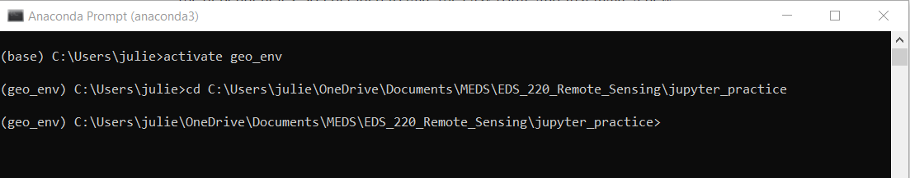

- Download your spatial data files to this folder to make your life easier when you import your spatial data.  
- If using Jupyter Notebooks, open a new one by running: `jupyter notebook`. This will pop open Jupyter Notebook in your browser with your folder of choice already open and ready to go. In the upper right side, open a new notebook. If using VScode, run: `touch spatial_analysis.ipynb`

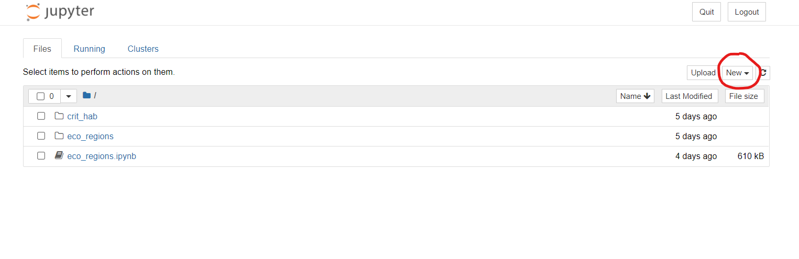

- Note: the Anaconda terminal window you used to open this notebook should not be closed during your work session. It must remain open to keep your kernel connected and give you the ability to save! If you need to run any terminal commands after you have already opened this notebook, such as if you need to download a package or check a file location, just open up another terminal window and enter the `geo_env` environment to do so.

## Importing Packages

For plotting shapefiles, you'll want to import the following packages:  

```python
import pandas as pd  
import numpy as np  
import geopandas as gpd  
import matplotlib.pyplot as plt # plot our data and manipulate the plot
import contextily as ctx # add a default basemap under our polygons of interest
```

If you do not already have `contextily` installed, use a `conda forge` command to install it in the terminal in your environment if you used `conda forge` to install previous packages. If you used pip to install other packages, stick with `pip`. It is not wise to mix `conda forge` and `pip` in the same environment because dependencies can conflict.

I like to include a markdown chunk following my package imports that includes a URL link to where I found my data, a citation, and notes about how I downloaded it for myself or anyone else working through my code:

```
Data source: [US Fish and Wildlife](https://ecos.fws.gov/ecp/report/table/critical-habitat.html)\ 
- contains .shp, .dbf, and .shx polygon files that relate to critical species habiata in the United States\
- I chose the first zip file you see on this site
```

## Importing Data

We will use `geopandas` to read in the **shapefile** with  polygons or lines or points You might take a look at all the file extensions and feel overwhelmed. Shapefiles and their metadata are stored separately (.shp, .dbf, .shx, .xml, and so on). In this example we are trying to import a **shapefile** of polygons, so that **.shp** file is the only one you need to read in:   

```python
gdf = gpd.read_file('CRITHAB_POLY.shp')
```

By simply typing `gdf`, we get a nicely formatted preview of the geodataframe:

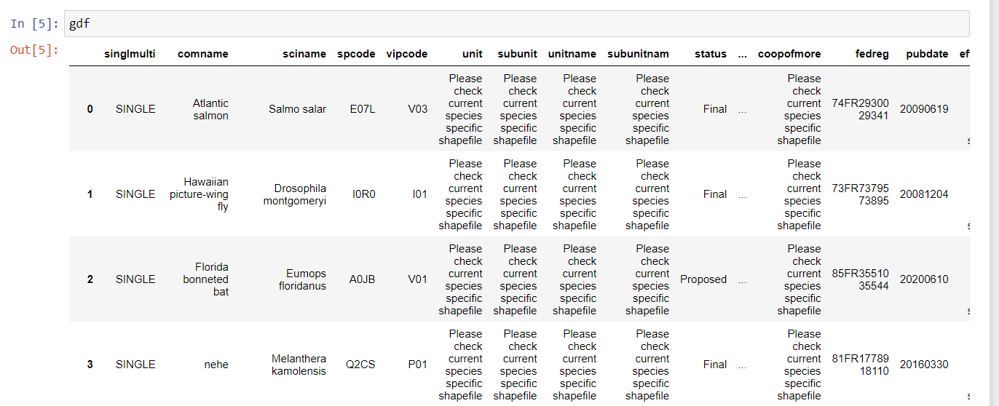

This shapefile contains polygons that designate the critical habitat ranges for many endangered and threatened species in the United States.

Practice simple commands like calling all the column names in the dataframe:  

```python
print(gdf.columns)
```

Check the factor levels for the columns `listing_st`:  

```python
status_levels = gdf.listing_st.unique()
status_levels
```

Using U.S. Fish and Wildlife as an example, now that you know the factor levels of a categorical variable, you can subset for only *"endangered"* species, only *"threatened"* species, etc.  

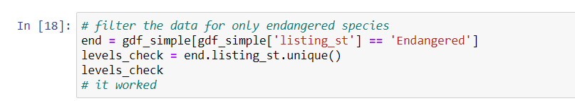

Play around with your dataframe a bit; Google some of the species, subset the columns, search for `NA` values, or take the average of a column. After you make a structural change, its a good habit to check the status or dimensions of your dataframe.

Check the number of rows and columns:
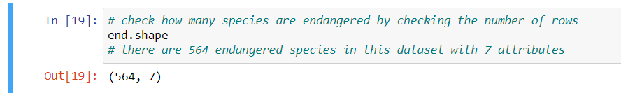

Print the latitude and longitude pairs that make up a particular polygon:
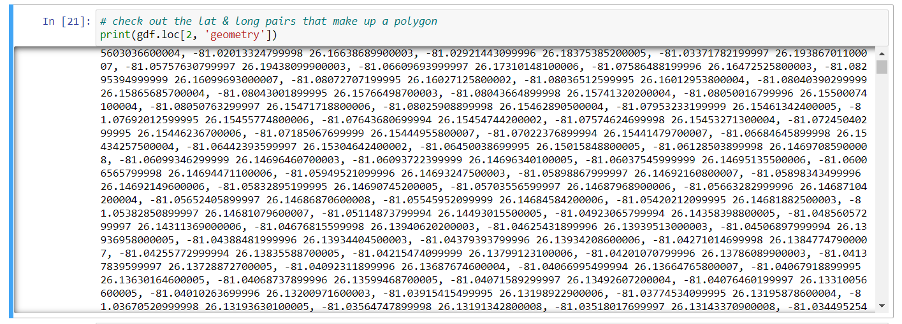

## Setting the Coordinate Reference System  

As a last step before you plot, you have to make sure you **set** and then **transform** the data to the desired coordinate reference system (CRS). This is standard for all kinds of spatial data, since your data might come with an undesired CRS or lack information about it. For information about coordinate reference systems, check out [this guide.](https://www.nceas.ucsb.edu/sites/default/files/2020-04/OverviewCoordinateReferenceSystems.pdf)  

Three common CRS's are as follows:   

- **WGS84 (EPSG: 4326)**, which is commonly used for GIS data across the globe or across multiple countries  

- **NAD83 (EPSG:4269)**, which is most commonly used for federal agencies  

- **Mercator (EPSG: 3857)**, which is projected, uses units of meters, and used for tiles from Google Maps, Open Street Maps, and Stamen Maps. I will use this one today because I want to overlay my polygons onto a Google basemap with `contextily`. 

Once you set the CRS, transform it:

```python
gdf_3857 = to_crs(epsg = "3857", inplace = False)
```

## Plotting Shapefiles on a Basemap

Use the `plot()` function from `matplotlib` and assign the palette to the species attribute:

```python
gdf_3857.plot(column = 'comname',
             figsize = 20,20))
```
             
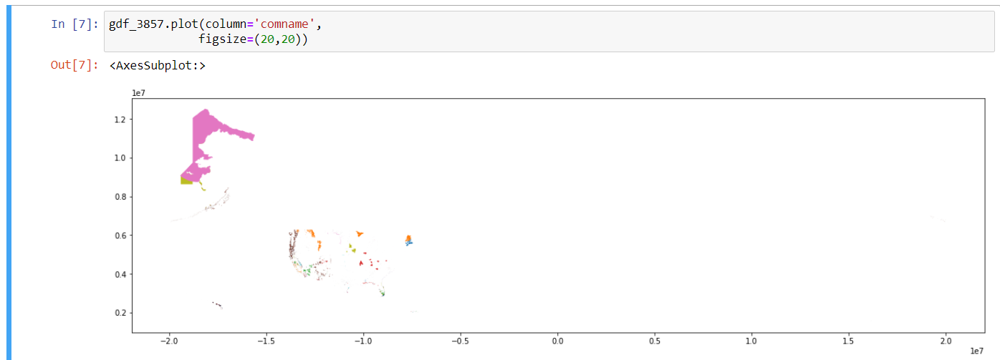

Note that you did not have to call the package to use the function `plot()`. Instead, you can name the dataframe which you want to plot, which is `gdf_3857` in this case, *then* `plot()` and add arguments and supplemental plot structure changes as you go.
             
The `figsize` can be whatever you want. You have finer control over the degree of zoom of the map with the arguments `xlim()` and `ylim()`. These polygons are just floating in space, so lets add a basemap to give us geographical context:  

```python
crit_hab_polys = gdf_3857.plot(column = 'comname',
                              figsize = (20,20))
```       
      
Notice that I used an argument in the plot function, setting the `column = 'comname'`, which specifies the common name for the species in that row. This argument sets a unique color to each common name, which will help us tell the difference between each species' habitat on the map, even if 1 species' habitat is composed of multiple polygons.

```python
ctx.add_basemap(crit_hab_polys)

# Set the axis limits to zoom in on just the lower 48 states
plt.ylim([2350000,6350000])
```

Since the extent of the basemap within the `contextily` package is the entire world, we need to specify the x-limitations and y-limitations for our map so we can zoom in on the United States. The default x and y units were in the millions, so I specified my units in millions, too. When considering if I should plug in positive or negative values, I considered the way that coordinate reference systems are designed with positive values for North and East, and negative values for South and West. I considered that the United States is north of the equator, so I should have positive values for the min and max y. As for the magnitude of my values, I simply looked at the map for a starting point and played around with different numbers until I got the view I wanted.

```python
plt.xlim([-14000000,-6000000])
```

Notice that these values are negative. Along similar thinking to how we decided on our y limitation, these negative values are the result of how coordinate systems are designed. Consider the prime meridian (which lies at 0 degrees in the East and West directions) with West being negative. Since the United States are to the West of the prime meridian, we know that the x-range for our zoom should be negative. As for the magnitude, I just played around with the numbers until I got the East-West orientation that encompassed the United States.
Use the `show()` function in `matplotlib` to tell Python to show the most recently created graph:  
`plt.show()`   

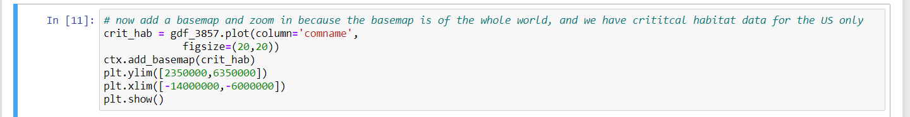
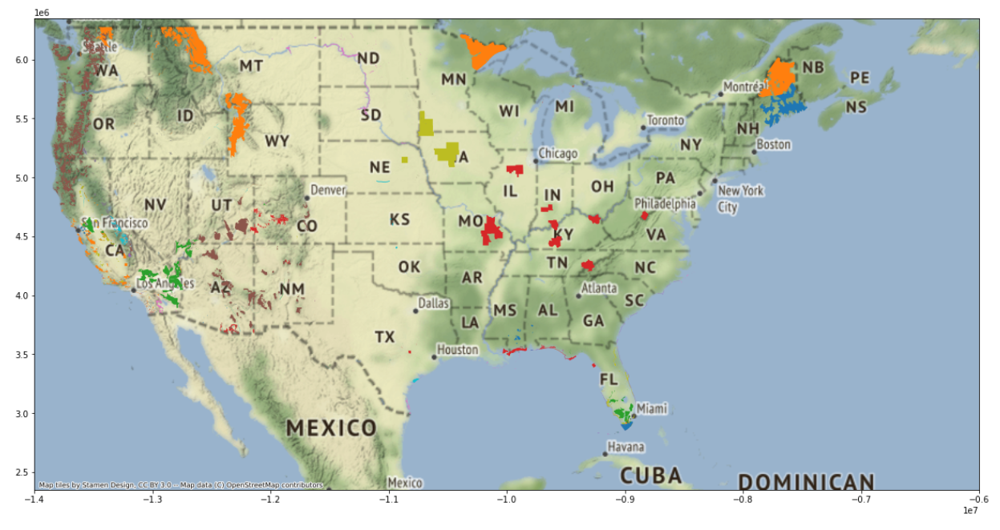

You did it! Welcome to the wonderful world of geospatial data in Python.

## Future Analysis

With this basic skill mastered, you can now dive deeper into this data to determine if variables are correlated across space. Considering state borders, you might ask **which endangered species occupy critical habitat in your home state?** and investigate the different wildlife protection policies across the United States. Alternatively, you could approach this data from an environmental perspective and ask **which natural biomes contain the most critical habitat for these endangered species? Are these habitats degrading at a faster rate than those that contain less critical habitat?**

## A Local California Use Case Example

Living in Santa Barbara, I'm interested in the critical habitat of the [Southern California Steelhead Trout](https://caltrout.org/projects/southern-steelhead-coalitions?gclid=Cj0KCQiAnuGNBhCPARIsACbnLzqlPTHi_8N97R1bTOP89j3yll1YHZG7ZSOuw0SDgKX-zrAOmTIzlckaAqfYEALw_wcB). Steelhead trout is a beautiful fish species that interbreeds with resident rainbow trout in many coastal regions throughout California, which are split into distinct population segments: 

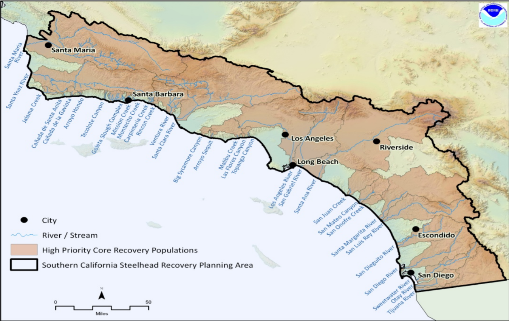

I was lucky enough to conduct field work with these migratory fish with the Pacific States Marine Fisheries Committee. I grew to appreciate their role in ecosystem processes and the culture of indigenous people. This fish has been on the federal endangered species list for years, but was just recently listed as a California endangered species in 2024. This will hopefully expand critical habitat range, increase monitoring of the populations, and help enforce illegal fishing and pollution regulation in their habitat. **We can check out the steelhead's critical habitat range before and after 2024 to see how it expands over time and space.**

<center>

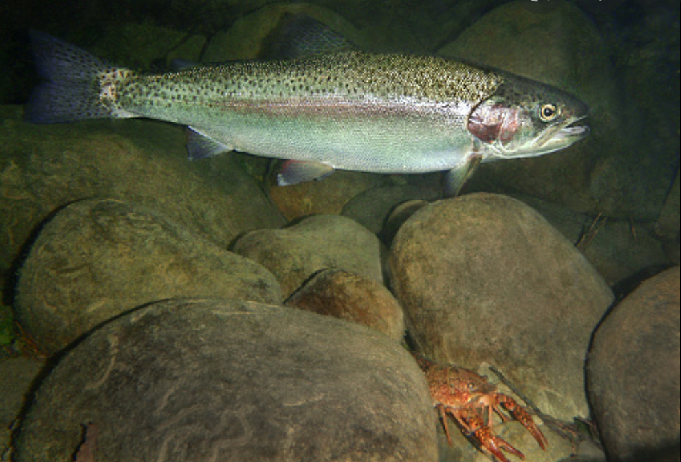{width=85%}

</center>

### Sources & supplemental information on listed endangered species in the United States:

1. [Florida bonneted bat photo](https://www.joelsartore.com/esa002-00161/n)\
2. [U.S. Fish and Wildlife data](https://ecos.fws.gov/ecp/report/table/critical-habitat.html)\
3. [U.S. Fish and Wildlife's Environmental Conservation Online system](https://ecos.fws.gov/ecp/)\
4. [U.S. Fish and Wildlife listed wildlife species](https://ecos.fws.gov/ecp/report/species-listings-by-tax-group?statusCategory=Listed&groupName=All%20Animals)\
- this includes links for data on each each species and a map of their habitat\
5. [Southern California Steelhead Trout](https://caltrout.org/projects/southern-steelhead-coalitions?gclid=Cj0KCQiAnuGNBhCPARIsACbnLzqlPTHi_8N97R1bTOP89j3yll1YHZG7ZSOuw0SDgKX-zrAOmTIzlckaAqfYEALw_wcB)
6. [Southern California Steelhead Trout distinct population segement map](https://fsp.sdsu.edu/wp-content/uploads/2012/02/Southern_California_Steelhead_Recovery_Plan_Summary_Corrected_012712.pdf)
7. [Southern California Steelhead Trout](https://www.istockphoto.com/photo/southern-california-steelhead-gm982288486-266730619)
8. [Python logo](https://ourcodeworld.com/articles/read/635/why-should-i-learn-python-programming-language)


