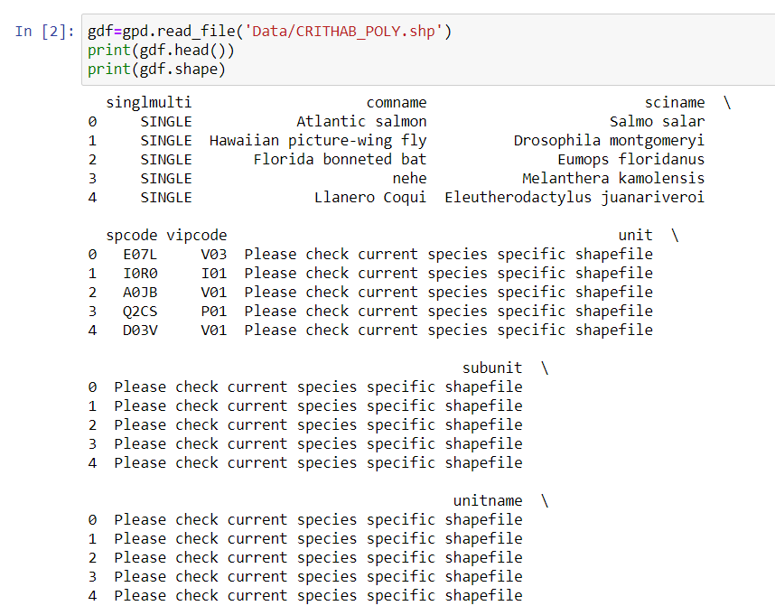

```{r setup, include=FALSE}
knitr::opts_chunk$set(echo = FALSE)
```


Python is a wonderful programming language to plot shapefiles overlaid on top of basemaps, which gives us the user spatial context and opens doors for deeper analysis. Understanding where points, lines, and polygons exist in the world empowers data scientists to answer questions about correlated variables, consider new questions that arise throughout the analysis process, and communicate conclusions to audiences in an easily-digestible way.

This blog post will walk you through this process, starting with installing the an integrated development environment (IDE) Jupyter Notebook and installing the necessary packages. If you prefer to use another IDE such as Visual Studio Code and have already installed the packages `geopandas`, feel free to jump ahead to the **Importing Packages** section.

As a conservation biologist and an aspiring data scientist, I'm interested in plotting endangered species' critical habitat ranges throughout the United States. I sourced my data from the U.S. Geological Survey [here](https://ecos.fws.gov/ecp/report/table/critical-habitat.html). I'm a big fan of USGS datasets because they are usually relatively clean and provide comprehensive metadata.

Let's map the critical habitat ranges of the Florida Bonneted bat and many other species of concern on a basemap of the United States.


## Getting started with Python and Jupyter Notebooks

Transitioning from `R` in `Rstudio`to `Python` in `Jupyter Notebook` can be difficult, as is learning any new language. We have to say goodbye to the exceptionally user-friendly RStudio interface with its git graphical user interface, visible environment, and easily accessible console and terminal windows. Let's dive into the objected oriented language of Python through Jupyter Notebook and the mysterious terminal. Personally, I struggled every step of this journey with lots of syntax errors, merge conflicts, and endless Google searching. I hope this post will help hold your hand as we make this change together.

First things first, if you're using Jupyter Notebooks to code in Python, you're gonna have to install Python and Anaconda Navigator and install `Anaconda` into your home directory. (Note: there are plenty of other IDE's for python, such as [visual studio code](https://code.visualstudio.com/), which I adopted later in my data science career).

As a PC user, installing `Anaconda` really threw me and my laptop for a loop. But what better way to learn to use the terminal besides struggling to install stuff you desperately need for graduate school? Errors and trouble-shooting is what makes us stronger data scientists, even if we don't want to recognize that as we fight the urge to throw our computer out the window. Click [here](https://docs.conda.io/projects/conda/en/latest/user-guide/install/macos.html) for a great resource to walk you through installing `Anaconda`. Either `Anaconda` or `Miniconda` will work fine.

After installing Anaconda, start your journey plotting shapefiles in `Python` by opening up Jupyter Notebooks. I like to do this from the Anaconda Prompt (the Aanconda terminal), because I'm working on a PC and it's tricky to get my normal command line or Bash to recognize that `conda` is indeed on my computer. My favorite flow is as follows:

- From the start menu, open a terminal through Anaconda Navigator that's called "Anaconda Prompt".  
- Install `geopandas` with `conda install geopandas` in your base environment (which is the default). If that doesn't work (which would not surprise me if you're on a PC), create a new environment to do so. I found the steps on this website to be helpful: https://medium.com/analytics-vidhya/fastest-way-to-install-geopandas-in-jupyter-notebook-on-windows-8f734e11fa2b. I tried installing `geopandas` in my base environment, but it was difficult to install all the correct versions of all the dependencies, so I decided to take the easy route and just make a new environment for `geopandas` and any other spatial analysis packages I'll need. Maybe one day I'll get familiar with version-specific terminal installations and I will be able to install whatever my heart pleases in my base environment.    
- Activate the environment in which you have installed the `geopandas` package. I named that environment `geo_env`, so I type `activate geo_env`.   
- Now that I am in my desired environment, I am going to navigate to the folder in my terminal  in which I want to open and save my Jupyter Notebook. That command is `cd file/path/to/folder`. You know this worked if your terminal working directory now has that file path tacked onto the end. This file path step is **not required** if you want to include **relative file paths** to import data and save your notebook. Personally, I do not recommend using relative file paths if you can avoid it in any interface.  


- Download your spatial data files to this folder to make your life easier in 2 minutes when you import your spatial data in Jupyter Notebook.  
- Open Jupyter Notebooks by typing just that: `jupyter notebook`. This will tell your terminal to pop open Jupyter Notebook in your browser with your folder of choice already open and ready to go.  
- In the upper right side, open a new notebook.  


- Note: the Anaconda terminal window you used to open this notebook should not be closed during your work session. It must remain open to keep your kernel connected and give you the ability to save! If you need to run any terminal commands after you have already opened this notebook, such as if you need to download a package or check a file location, just open up another terminal window and enter the geo_env environment to do so.

## Importing Packages (`modules`)

For plotting shapefiles, you'll want to import the following packages:  

import `pandas` as pd  
import `numpy` as np  
import `geopandas` as gpd  
import `matplotlib.pyplot` as plt  
import `contextily` as ctx  

`matplotlib` will allow us to plot our data and manipulate the plot as we see fit.
`contextily` will allow us to add a default basemap under our polygons of interest. If you do not already have this installed, consider using a channel and conda forge to install it in the terminal.

As a proponent of reproducibility and credditing those who provided the data, I like to include a markdown chunk following my package imports that includes a URL link to where I found my data, along with a citation if necessary and any notes about how I downloaded it:

Data source: US Fish and Wildlife https://ecos.fws.gov/ecp/report/table/critical-habitat.html  
- contains .shp, .dbf, and .shx polygon files that relate to critical species habiata in the United States
- I chose the first zip file you see on this site  
- good metadata available  

## Importing Data

Let's import your data! Now is the time you're gonna be thanking yourself for placing your jupyter notebook in the same folder as your data. We will use `geopandas` to read in the **shapefile** with your polygons or lines or points of choice (you will not find a combination of these shapes in the same shapefile, because that's just how the world works). You might take a look at all the data files and feel a little overwhelmed at the choices due to the way that shapefiles and their metadata are stored separately (.shp, .dbf, .shx, .xml, and so on). In this example we are trying to import a **shapefile** of polygons, so that **.shp** file is the only one you need to read in:   

Import the data:  
`gdf = gpd.read_file('CRITHAB_POLY.shp')`  
Take a look at the first rows:  
`print(gdf.head())`  
Ask Python how many rows and columns are in this dataframe:  
`print(gdf.shape)`   

My only complaint with the `head()` function is that it returns the first rows in a plain text format:



If you want to see the first and last few rows of the dataframe in a format that looks more familiar (like how R studio presents dataframes), try just typing the name of the data frame, `gdf`:  


This shapefile I read in contains polygons that designate the critical habitat ranges for many endangered and threatened species in the United States. I chose to name it `gdf` for *geodataframe*. While you can name objects whatever you want, it is helpful to you and to those reading your code to name things meaningfully. Expect that you will be modifying this dataframe as you go through this mapping process (subsetting columns, filtering for certain factor levels, etc.) so you will likely be tacking on more words to `gdf` to tell these modified versions apart. Start naming things simply and clearly, and get more specific as you process your data.  

If your dataset has a lot of columns and you want to call them, you can use:  

`print(gdf.columns)`  

Wanna check the different factor levels in this dataset? Run the following:   
`status_levels = gdf.listing_st.unique()`  
`status_levels`  

Using U.S. Fish and Wildlife as an example, now that you know the factor levels of a categorical variable, you can subset for only *"endangered"* species, only *"threatened"* species, etc.  


Feel free to play around with your dataset a bit. Google some of the species, subset the columns, search for some NA values, or take the average of a numerical column. After you make a structural change, its a good habit to check the status or dimensions of your dataset.

Check the number of rows and columns:


Print the latitude and longitude pairs that make up a particular polygon:


## Setting the Coordinate Reference System  

As a last step before you plot, you have to make sure you set the data to the desired coordinate reference system (CRS). This is pretty standard for all kinds of spatial data, since your data might come with an unfamiliar CRS or have no CRS at all if you are making a mask, a raster, or executing similar geospatial processes. For information about coordinate reference systems, check out this guide:   
https://www.nceas.ucsb.edu/sites/default/files/2020-04/OverviewCoordinateReferenceSystems.pdf  

But you technically do not need to understand many details about datums and CRS's for mapping shapefiles, so just for now you should know 3 common CRS's:   

- **WGS84 (EPSG: 4326)**, which is commonly used for GIS data across the globe or across multiple countries  
and   
- **NAD83 (EPSG:4269)**, which is most commonly used for federal agencies  
and  
- **Mercator (EPSG: 3857)**, which is used for tiles from Google Maps, Open Street Maps, and Stamen
Maps. I will use this one today because I want to overlay my polygons onto a Google basemap with `contextily`.  

Set the crs:  
`gdf_3857=gdf.to_crs(epsg=3857)`  
Check that the CRS is what you want:  
`print(gdf_3857.crs)`  

This code may take a minute to run. In Jupyter Notebook, you know that code chunk is still chuggin' away if you see an asterisk in brackets to the left of the code chunk:


## Plotting Shapefiles on a Basemap

Use the plot() function from matplotlib and make the fill depend on the species name:
`gdf_3857.plot(column='comname',`   
             `figsize=(20,20))`  
             


Note that you did not have to call the package to use the function plot(). Instead, you can name the dataframe which you want to plot, which is `gdf_3857` in this case, *then* specify the function plot() and add arguments and supplemental plot structure changes as you go.
             
The fig size can be whatever you want. 10-20 is usually good enough. You have finer control over the degree of zoom of the map with the arguments xlim() and ylim(), anyway. These polygons are just floating in space, so lets add a basemap to give us geographical context:  

`crit_hab_polys = gdf_3857.plot(column='comname',`  
             `figsize=(20,20))`  
Notice that I used an argument in the plot function, setting the `column = 'comname'`, which is a column within the `gdf_3857` geodataframe that specifies the common name for the species in that row. This argument sets a unique color to each common name, which will help us tell the difference between each species' habitat on the map, even if 1 species' habitat is composed of multiple polygons.
`ctx.add_basemap(crit_hab_polys)`  
Set the axis limits to zoom in on just the lower 48 states, rather than viewing the entire world:  
`plt.ylim([2350000,6350000])`  
Since the basemap within the contextily package is of the entire world, we need to specify the x-limitations and y-limitations for our map so we can zoom in on the United States to best understand our data. The default x and y units were in the millions, so I specified my units in millions, too. When considering if I should plug in positive or negative values, I considered the way that coordinate reference systems are designed with positive values for North and East, and negative values for South and West. I considered that the United States are north of the equator (which is 0 in the North and South directions), so I should have positive values for the min and max y. As for the magnitude of my values, I simply looked at the map for a starting point and played around with different numbers until I got the view I wanted.
`plt.xlim([-14000000,-6000000])` 
Notice that these values are negative. Along similar thinking to how we decided on our y limitation, these negative values are the result of how coordinate systems are designed. Consider the prime meridian (which lies at 0 degrees in the East and West directions) with West being negative. Since the United States are to the West of the prime meridian, we know that the x-range for our zoom should be negative. As for the magnitude, I just palyed around with the numbers until I got the East-West orientation that encompassed the United States.
Use the `show()` function in `matplotlib` to tell Python to show the most recently created graph:  
`plt.show()`   


You did it! Welcome to the wonderful world of geospatial data in Python.

## Future Analysis

With this basic skill mastered, you can now dive deeper into this data to determine if variables are correlated across space. Considering state borders, you might ask **which endangered species occupy ciritical habitat in your home state?** and investigate the different wildlife protection policies across the United States. Alternatively, you could approach this data from an environmental perspective and ask **which natural biomes contain the most critical habitat for these endangered species? Are these habitats degrading at a faster rate than those that contain less critical habitat?**

## A Local California Use Case Example

Living in Santa Barbara, I'm interested in the critical habitat of the [Southern California Steelhead Trout](https://caltrout.org/projects/southern-steelhead-coalitions?gclid=Cj0KCQiAnuGNBhCPARIsACbnLzqlPTHi_8N97R1bTOP89j3yll1YHZG7ZSOuw0SDgKX-zrAOmTIzlckaAqfYEALw_wcB). Steelhead trout is a beautiful fish species that interbreeds with resident rainbow trout in many coastal regions throughout California, which are split into distinct population segments and managed as such. 


I was lucky enough to conduct field work with these migratory fish in 2020-2021 through the California Department of Fish and Wildlife and the Pacific States Marine Fisheries Committee. I grew to appreciate their vital role in ecosystem processes and the culture of indigenous people who have interacted with them for centuries. This fish is currently in the process of being listed as a California endangered species starting in December of 2021, which will hopefully expand critical habitat range, increase monitoring of the populations, and help enforce illegal fishing and pollution regulation in their habitat. We can check out the steelhead's critical habitat range before and after 2021 to see how it expands over time and space.


### Sources & supplemental information on listed endangered species in the United States:

1. [Florida bonneted bat photo](https://www.joelsartore.com/esa002-00161/n)\
2. [U.S. Fish and Wildlife data](https://ecos.fws.gov/ecp/report/table/critical-habitat.html)\
3. [U.S. Fish and Wildlife's Environmental Conservation Online system](https://ecos.fws.gov/ecp/)\
4. [U.S. Fish and Wildlife listed wildlife species](https://ecos.fws.gov/ecp/report/species-listings-by-tax-group?statusCategory=Listed&groupName=All%20Animals)\
- this includes links for data on each each species and a map of their habitat\
5. [Southern California Steelhead Trout](https://caltrout.org/projects/southern-steelhead-coalitions?gclid=Cj0KCQiAnuGNBhCPARIsACbnLzqlPTHi_8N97R1bTOP89j3yll1YHZG7ZSOuw0SDgKX-zrAOmTIzlckaAqfYEALw_wcB)
6. [Southern California Steelhead Trout distinct population segement map](https://fsp.sdsu.edu/wp-content/uploads/2012/02/Southern_California_Steelhead_Recovery_Plan_Summary_Corrected_012712.pdf)
7. [Southern California Steelhead Trout](https://www.istockphoto.com/photo/southern-california-steelhead-gm982288486-266730619)
8. [Python logo](https://ourcodeworld.com/articles/read/635/why-should-i-learn-python-programming-language)


