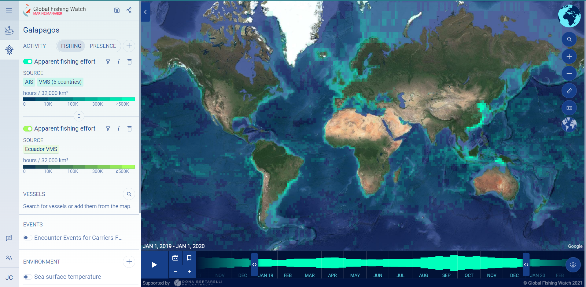
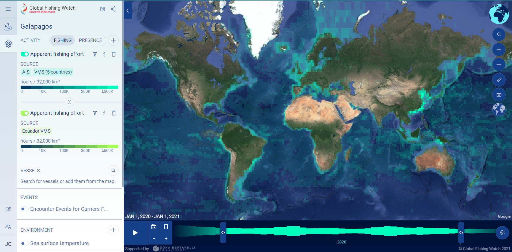
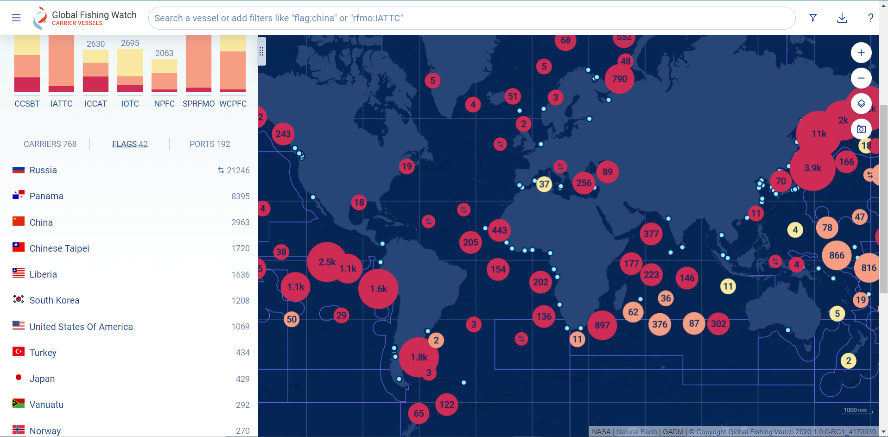

```{r setup, include=FALSE}
knitr::opts_chunk$set(echo = TRUE, eval=FALSE)
```

## Covid-19 and Global Fishing Activity 

2020 is a year we will never forget. Covid-19 spread rapidly across the globe and forced most of humanity into a state of quarantine. Covid-19 had clear devastating impacts on economies of all scales. Travel was heavily limited, and even when crossing country borders was possible, it was heavily monitored. However, the pandemic boosted some sectors of the economy and increased demand for certain goods. How did Covid-19 affect fishing activity? Did fisheries respond to the pandemic by sending fishermen and fisherwomen home to quarantine, or did some countries see this as an opportunity to fish in the high seas more than ever before? Regulating fishing and other vessel activities across the globe is a challenge in itself due to a lack of reliable data from automatic identification systems and voluntary vessel registration by the fishermen and fisherwomen. [Global Fishing Watch](https://globalfishingwatch.org/) is an organization that aims to revolutionize the way we monitor fishing activity across the world using remote sensing techniques from satellites combined with automatic identification systems. Global Fishing Watch collects and visualizes global fishing data with the goal of embracing ocean sustainability, transparency, and open-source science. They keep track of vessels from all different countries, including their movements, boat types, and time stamps for fishing and docking at ports. Without efforts to monitor, publicize, and regulate ocean activity, our marine resources are at high risk of depletion. With modern data science and applied statistics, we can better understand fishing activity on a global scale and protect Earth's marine biodiversity.

As an aspiring wildlife biologist and data scientist, I'm interested in applying statistical analysis to [Global Fishing Watch data](https://globalfishingwatch.org/datasets-and-code/) to learn how different countries' fishing effort changed in 2020, relative to those countries' fishing trends in the years leading up to 2020. Fishing effort is often defined by the amount of hours spent fishing. With Global Fishing Watch's expansive open-source data collection, we can approach this question by grouping all vessels' fishing hours by country, identifying a statistical trend up until 2019, and extrapolating that trend into 2020. By comparing this 2020 prediction to the actual fishing data available for 2020, we can glean how Covid-19 skewed large-scale fishing efforts. Perhaps the global fishing economy sky-rocketed, plummeted into near nonexistence, or remained unscathed by the pandemic. Quantitative analysis will help provide some insight.

Global Fishing Watch offers an [interactive map](https://globalfishingwatch.org/map/?latitude=19&longitude=-30&zoom=1.5&start=2021-08-26T23%3A00%3A00.000Z&end=2021-11-27T00%3A00%3A00.000Z) that displays fishing activity across the globe through a heat map. This visualization has the potential to inspire data scientists, fish enthusiasts, environmental justice advocates, pandemic researchers, and everyone in between to examine fishing activity during a time period of interest. 

#### **Global fishing activity from January 1, 2019 through January 1, 2020.**


#### **Global fishing activity from January 1, 2020 through January 1, 2021.**


Global Fishing Watch and their partners also provide an [interactive map](https://globalfishingwatch.org/carrier-portal/?latitude=12.7069821&longitude=19.1776829&zoom=1.1903704&layer[0]=encounter&layer[1]=cp_rfmo&layer[2]=cp_next_port&dataset=carriers:v20211001&tab=flags) that allows users to interact with vessels across the globe, filter by country, and overlay port locations on coastlines.

#### **Global vessel activity by country from January 1, 2017 through September 30, 2021**


First things first, let's import our necessary R packages and the dataset from Global Fishing Watch that includes country identification for each vessel as well as fishing hours by year:

```{r}
# the tidyverse includes my go-to set of functions for data cleaning and wrangling
library(tidyverse)
# lubridate helps us manage time stamps and annual trends
library(lubridate)
#library(broom)
#library(forecast)
#library(purrr)
# gt helps make beautiful tables to summarize our data
library(gt)
```

```{r}
data = read_csv(file.path('data', 'fishing-vessels-v2.csv'))
```

**Data source:** [Global Fishing Watch: Datasets and Code, fishing effort data](https://globalfishingwatch.org/data-download/datasets/public-fishing-effort)\

### Data Cleaning and Wrangling

This dataset includes fishing effort and vessel information from 124 countries over the years 2012-2020. First, we select our variables of interest, group by country, and take the fishing effort means per year.

```{r}
# clean the data, selecting only relevant column of fishing hours and taking the means by year for each country

effort_trends <- data %>% 
  select(flag_gfw, 
         fishing_hours_2012,
         fishing_hours_2013,
         fishing_hours_2014,
         fishing_hours_2015,
         fishing_hours_2016,
         fishing_hours_2017,
         fishing_hours_2018,
         fishing_hours_2019,
         fishing_hours_2020) %>% 
  group_by(flag_gfw) %>% 
  summarize("2012" = mean(fishing_hours_2012, na.rm = TRUE),
            "2013" = mean(fishing_hours_2013, na.rm = TRUE),
            "2014" = mean(fishing_hours_2014, na.rm = TRUE),
            "2015" = mean(fishing_hours_2015, na.rm = TRUE),
            "2016" = mean(fishing_hours_2016, na.rm = TRUE),
            "2017" = mean(fishing_hours_2017, na.rm = TRUE),
            "2018" = mean(fishing_hours_2018, na.rm = TRUE),
            "2019" = mean(fishing_hours_2019, na.rm = TRUE),
            "2020" = mean(fishing_hours_2020, na.rm = TRUE))

```


#### Resources:

- [Global Fishing Watch](https://globalfishingwatch.org/) website\
- [Global Fishing Watch: Datasets and Code, Fishing effort data](https://globalfishingwatch.org/data-download/datasets/public-fishing-effort)\
- note: Users must make a free account in order to access datasets\
- [Pictures 1 & 2](https://globalfishingwatch.org/map/?latitude=19&longitude=-30&zoom=1.5&start=2021-08-26T23%3A00%3A00.000Z&end=2021-11-27T00%3A00%3A00.000Z)
- [Picture 3](https://globalfishingwatch.org/carrier-portal/?latitude=12.7069821&longitude=19.1776829&zoom=1.1903704&layer[0]=encounter&layer[1]=cp_rfmo&layer[2]=cp_next_port&dataset=carriers:v20211001&tab=flags)


Distill is a publication format for scientific and technical writing, native to the web.

Learn more about using Distill at <https://rstudio.github.io/distill>.


