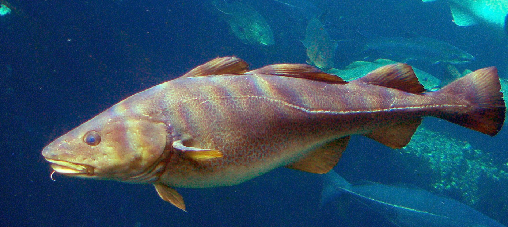
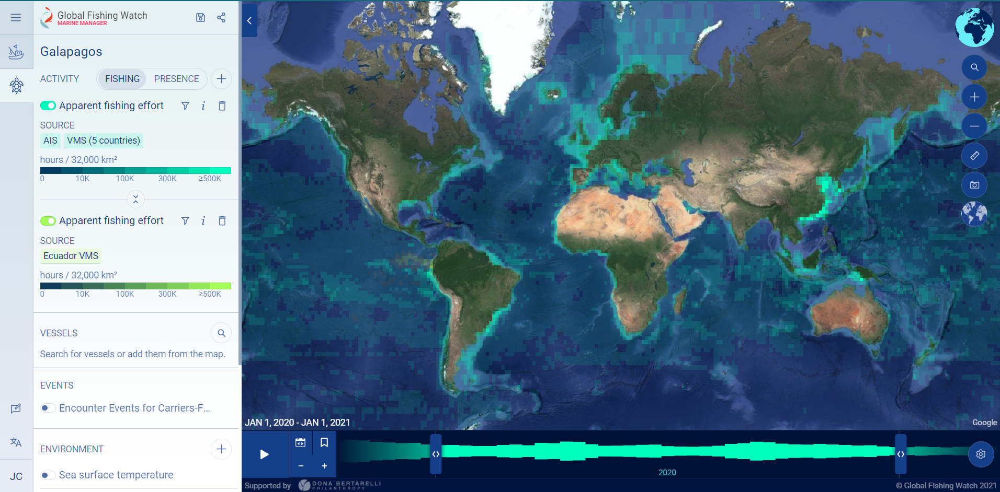
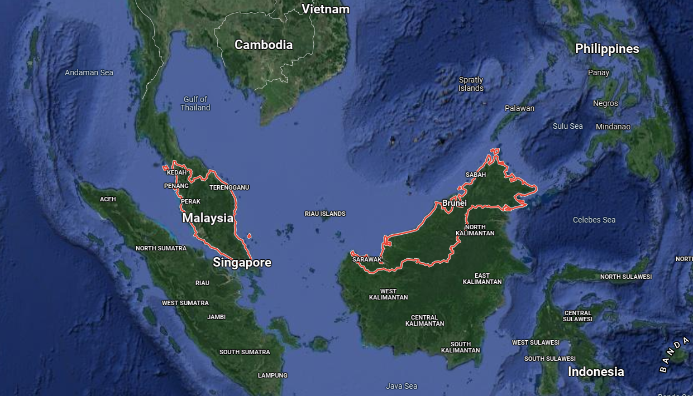
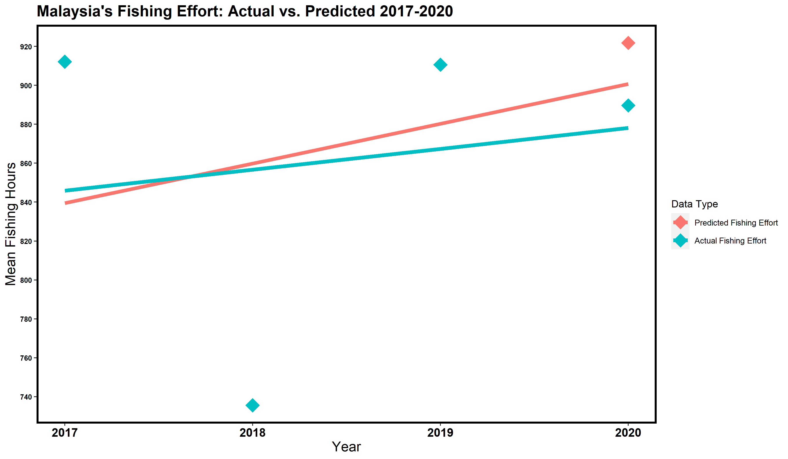
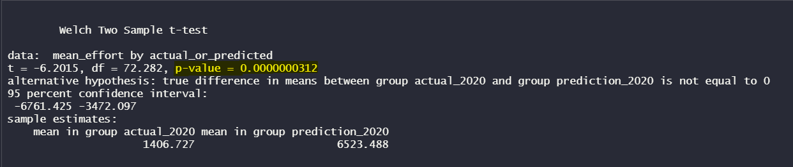
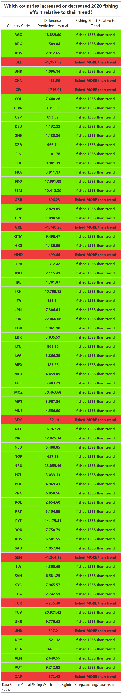

```{r setup, include=FALSE}
knitr::opts_chunk$set(echo = FALSE, eval = FALSE)
```

{width=80%}

## How did global fishing activity change during the Covid-19 pandemic?

2020 is a year we will never forget. Covid-19 spread rapidly across the globe and forced most of humanity into a state of quarantine. Covid-19 had clear devastating impacts on economies of all scales. Travel was heavily limited, and even when crossing country borders was possible, it was heavily monitored. However, the pandemic boosted some sectors of the economy and increased demand for certain goods. How did Covid-19 impact the fishing economy? Did fisheries respond to the pandemic by sending fishermen and fisherwomen home to quarantine, or did some countries see this as an opportunity to fish in the high seas more than ever before? Regulating fishing and other vessel activities across the globe is a challenge in itself (4). Databases often have large gaps due to various causes such as a lack of reliable data from automatic identification systems and voluntary vessel registration by the owners of the vessels. [Global Fishing Watch](https://globalfishingwatch.org/) is an organization that aims to revolutionize the way we monitor fishing activity across the world using remote sensing techniques from satellites combined with automatic identification systems. Global Fishing Watch collects and visualizes global fishing data with the goal of embracing ocean sustainability, transparency, and open-source science. They keep track of vessels from all different countries, including their movements, boat types, and time stamps for fishing and docking at ports. Without such efforts to monitor, publicize, and regulate ocean activity, our marine resources are at high risk of depletion. On a global scale, we are fishing faster than fish stocks can naturally replenish. This has severe economic impacts; according to the World Bank Report, the ensuing depletion of marine fish stocks causes economic losses of 50 billion US dollars annually (4). With modern data science and applied statistics, we can better understand fishing activity on a global scale and protect our planet's marine biodiversity.

As an aspiring wildlife biologist and data scientist, I'm interested in applying statistical analysis to [Global Fishing Watch data](https://globalfishingwatch.org/datasets-and-code/) to learn how different countries' fishing effort changed in 2020, relative to those countries' fishing trends in the years leading up to 2020. In this dataset, fishing effort is defined by the amount of hours spent fishing (3). With Global Fishing Watch's expansive open-source data collection, we can approach this question by grouping all vessels' fishing hours by country, identifying a statistical trend up until 2019, and extrapolating that trend into 2020. By comparing this 2020 prediction to the actual fishing data available for 2020, we can glean how Covid-19 skewed large-scale fishing efforts. Perhaps the global fishing economy sky-rocketed, plummeted into near nonexistence, or remained unscathed by the pandemic. Quantitative analysis will help provide some insight.

Global Fishing Watch offers an [interactive map](https://globalfishingwatch.org/map/?latitude=19&longitude=-30&zoom=1.5&start=2021-08-26T23%3A00%3A00.000Z&end=2021-11-27T00%3A00%3A00.000Z) that displays fishing activity across the globe through a heat map. This visualization has the potential to inspire data scientists, fish enthusiasts, environmental justice advocates, pandemic researchers, and everyone in between to examine fishing activity during a time period of interest. 

{width=70%}

Global Fishing Watch and their partners also provide an [interactive map](https://globalfishingwatch.org/carrier-portal/?latitude=12.7069821&longitude=19.1776829&zoom=1.1903704&layer[0]=encounter&layer[1]=cp_rfmo&layer[2]=cp_next_port&dataset=carriers:v20211001&tab=flags) that allows users to interact with vessels across the globe, filter by country, and overlay port locations on coastlines.

```{r}
# the tidyverse includes my go-to set of functions for data cleaning and wrangling
library(tidyverse)
# lubridate helps us manage time stamps and annual trends
library(lubridate)
# gt helps make beautiful tables to summarize our data
library(gt)
```

```{r}
data = read_csv(file.path('data', 'fishing-vessels-v2.csv'))
```

### Data Cleaning and Wrangling

Global Fishing Watch's data includes fishing effort and vessel information from 124 countries over the years 2012-2020. First, we select our variables of interest, group by country, and take the fishing effort means per year (3).

```{r}
# clean the data, selecting only relevant column of fishing hours and taking the means by year for each country

effort_trends <- data %>% 
  select(flag_gfw, 
         fishing_hours_2012,
         fishing_hours_2013,
         fishing_hours_2014,
         fishing_hours_2015,
         fishing_hours_2016,
         fishing_hours_2017,
         fishing_hours_2018,
         fishing_hours_2019,
         fishing_hours_2020) %>% 
  group_by(flag_gfw) %>% 
  summarize("2012" = mean(fishing_hours_2012, na.rm = TRUE),
            "2013" = mean(fishing_hours_2013, na.rm = TRUE),
            "2014" = mean(fishing_hours_2014, na.rm = TRUE),
            "2015" = mean(fishing_hours_2015, na.rm = TRUE),
            "2016" = mean(fishing_hours_2016, na.rm = TRUE),
            "2017" = mean(fishing_hours_2017, na.rm = TRUE),
            "2018" = mean(fishing_hours_2018, na.rm = TRUE),
            "2019" = mean(fishing_hours_2019, na.rm = TRUE),
            "2020" = mean(fishing_hours_2020, na.rm = TRUE))

```

Our goal is to run a linear regression on each country's fishing effort over multiple years, but many countries have `NA` data for certain years. Considering that we have data available for 2012-2020, which years should we choose? We want to select a chunk of continuous years leading up to 2020 with minimal data gaps. We want to minimize the amount of `NA` values because we will drop all rows with `NA` values, and we want to maintain the maximum amount of rows (which represent vessels) and countries as possible. In order to choose the start year for the time period that we will feed into the linear regression, we'll take a look at the amount of `NA` values in the years leading up to 2020. It turns out that 2017 has the least amount of `NA` values, so we will use that year to start our 3-year data period to feed to the linear regression. Next, we convert the data into **Tidy** format and remove `NA` values so we can run a time series linear regression analysis.

```{r}
# only need to look at 2012 - 2017 rather than 2012 - 2019 because we want a few years of data to plug into the linear regression
sum(is.na(effort_trends$"2012"))
sum(is.na(effort_trends$"2013"))
sum(is.na(effort_trends$"2014"))
sum(is.na(effort_trends$"2015"))
sum(is.na(effort_trends$"2016"))
sum(is.na(effort_trends$"2017"))

# change it to tidy format using pivot_longer()
# remove all NA values, and take out the year 2020 because we want to compare what we would EXPECT in 2020 based on what we saw in 2017-2019

effort_trends_tidy_no_na = effort_trends %>%
  select(flag_gfw, "2017":"2019") %>% 
  pivot_longer(cols = ("2017":"2019"),
               names_to = "year",
               values_to = "mean_effort") %>% 
  filter(!is.na(mean_effort),
         !is.na(flag_gfw))
```

Our dates are in years, and currently their class is `character` in the original dataset. We need these years in `date` format in order to run a linear regression over time. We will convert these years and remove all countries that only have data for 1 or 2 years, because we need multiple years of data to feed into the regression and we want each country to have equal amounts of data and start in the year 2017.

```{r}
# define day as Jan 1 so that when we convert the year to a date we get the first of the year so the plot looks better later on! Otherwise, R will paste TODAY'S date at the end of each year, which will skew the x axis when we plot later

month_day <- "-01-01"
effort_trends_tidy_no_na_date <- effort_trends_tidy_no_na %>% 
  mutate(year = paste0(year, month_day))

# remove those countries from the dataframe
countries_clean <- effort_trends_tidy_no_na_date %>% 
  group_by(flag_gfw) %>%
  filter(n()>2) %>% 
  mutate(year = as.Date(year, format = "%Y-%m-%d"))
```

### Linear Regression

Now that the data is sufficiently clean and our years are of class `date`, we can run a time series linear regression on every country's fishing effort from 2017-2019 and use the output coefficients to glean which direction each country is trending, meaning if the country is fishing more or less over time. We can do this with the `do()` function, grouping by country. We can set the function to output all the model coefficients as a list. Then we can feed this output into a for loop! We can plug in each country's fishing effort intercept and slope coefficients into a linear equation to predict the fishing effort in 2020 based on that country's historical trend. Subsequently, we can combine the predicted 2020 fishing effort data with the actual 2020 fishing effort data into a single dataframe to compare by country. We can make a new column that takes the difference of the actual and predicted values, and then add a column that explicitly states whether that country increased or decreased their fishing effort in 2020 relative to their trend leading up to 2020.

```{r}

# countries_clean %>% 
#   group_by(flag_gfw) %>% 
#   do(data.frame(., as.list(coef(lm(mean_effort~year, .)))))

# try to adjust the code that worked earlier to be like this code
# models <- sapply(unique(as.character(countries_clean$flag_gfw)),
#                  function(country)as.numeric(coef(lm(mean_effort~year, countries_clean, subset = (flag_gfw == country)))),
#                  simplify = FALSE, USE.NAMES = TRUE)
# #models[[4]]
# #models
# 
prediction_data = NULL;
for (i in 1:length(models)) {
  predicted_effort_2020 <- models[[i]][1] + models[[i]][2]*3
  prediction_data <- rbind(prediction_data, predicted_effort_2020)
  print(paste0("In 2020, the predicted fishing hours is ", predicted_effort_2020))
}

# figure out which countries were used in the for loop so we can get the actual 2020 effort data for those countries only
countries_clean_unique <- countries_clean %>% 
  group_by(flag_gfw) %>%
  slice_head(n = 1)

# set these countries as a vector so we can subset the effort_trends data to only include those countries
countries_to_compare <- unique(countries_clean_unique$flag_gfw)
countries_to_compare
  
# ensure that there are the same number of rows (countries) in both datasets
nrow(countries_clean_unique)
nrow(prediction_data)

# set the effort trends data to only include those countries
comparison_2020 <- effort_trends %>% 
  select(flag_gfw, "2020") %>%
  rename(actual_2020 = "2020") %>% 
  filter(str_detect(flag_gfw, paste(countries_to_compare, collapse="|"))) %>% 
  cbind(prediction_data) %>% 
  rename(prediction_2020 = prediction_data) %>% 
  filter(actual_2020 != "NaN")
# I made sure to remove the NAN values from the countries that did not have actual data for 2020 AFTER I USED cbind() because I wanted to bind the actual 2020 data to the corresponding rows with the predicted data first or else the alignment would yield incorrect data

# remove all negative values in the predicted column, the linear regression did not fit this data well
comparison_2020_pos <- comparison_2020 %>% 
  filter(prediction_2020 >= 0)

# take the difference between the actual and the predicted columns
comparison_2020_pos <- comparison_2020_pos %>% 
  mutate(difference = actual_2020 - prediction_2020) %>% 
  mutate(change_direc = case_when(
    difference < 0 ~ "fished LESS than trend",
    difference > 0 ~ "fished MORE than trend"))
```

### Plotting Actual Fishing Effort versus Predicted Fishing Effort for Malaysia

What does a single country's fishing trend look like? Let's consider the country of Malaysia in Southeast Asia. In 2015, Malaysia's fisheries sector employed 175,980 people and its contribution to national gross domestic product was 1.1%. The fish trade is valued at $1.7 billion (U.S. dollars), and the estimated average consumption of fish is 56.8 kg/person/year. Malaysian fisheries primarily capture shrimp, squid, and fish. Malaysia contributes to the global fish economy through both importing and exporting fish (6)

{width=60%}

We can make a country-specific fishing effort plot by filtering our *actual* fishing effort data to just that country, appending the *predicted* 2020 fishing effort data for that country that we produced through our linear model.

```{r}
# filter fishing effort and yearly means from the original data 

trends_mys <- effort_trends %>%
  select(flag_gfw, "2017":"2020") %>% 
  pivot_longer(cols = ("2017":"2020"),
               names_to = "year",
               values_to = "mean_effort") %>% 
  filter(!is.na(mean_effort),
         !is.na(flag_gfw))

month_day <- "-01-01"
trends_mys <- trends_mys %>% 
  mutate(year = paste0(year, month_day))

# remove those countries from the dataframe
mys_countries_clean <- trends_mys %>% 
  group_by(flag_gfw) %>%
  filter(n()>2,
         flag_gfw == "MYS") %>% 
  mutate(year = as.Date(year, format = "%Y-%m-%d")) %>% 
  rename(actual_mean_effort = mean_effort)

# add the predicted values for ARG
mys_countries_clean$prediction_2020 <- c(912.1514, 735.6150, 910.6168, 889.64468)

# now make a linear model on the actual and the predicted data

mys_model_actual = lm(actual_mean_effort ~ year, data = mys_countries_clean)
summary(mys_model_actual)

mys_model_predicted = lm(prediction_2020 ~ year, data = mys_countries_clean)
summary(mys_model_predicted)

# adjust the min and max values for the y-axis so that they are multiples of 10 and encompass all the mean_effort numbers, multiples of 10 are easier for the reader to comprehend quickly
max_y_mys = round(max(mys_countries_clean$actual_mean_effort+8), 0)
max_y_mys
min_y_mys = round(min(mys_countries_clean$actual_mean_effort-16), 0)
min_y_mys

# actual data = firebrick
# predicted data = forestgreen

mys_plot <- ggplot() +
   geom_point(data = mys_countries_clean,
              aes(x = year, y = actual_mean_effort, color = "firebrick"),
              size = 7,
              shape = 18) +
   geom_line(data = augment(mys_model_actual),
             aes(x = year, y = .fitted, color = "firebrick"),
             size = 2) + 
   geom_point(data = mys_countries_clean,
              aes(x = year, y = prediction_2020, color = "green"),
              size = 7,
              shape = 18) +
   geom_line(data = augment(mys_model_predicted),
             aes(x = year, y = .fitted, color = "green"),
             size = 2) +
   scale_x_date(date_labels = "%Y",
                date_breaks = "1 year") +
   ggtitle("Malaysia's Fishing Effort: Actual vs. Predicted 2017-2020") +
   xlab("Year") + 
   ylab("Mean Fishing Hours") +
   theme(panel.background = element_blank(),
         axis.title.x = element_text(color = "black", size = 15),
         axis.text.x = element_text(face = "bold", color = "black", size = 13),
         axis.title.y = element_text(color = "black", size = 15),
         axis.text.y = element_text(face = "bold", color = "black", size = 8),
         plot.title = element_text(color="black", size = 17, face = "bold"),
         panel.border = element_rect(colour = "black", fill = NA, size = 2),
         legend.position = "right") +
   scale_y_continuous(breaks = seq(min_y_mys, max_y_mys, by = 20)) +
   scale_color_discrete(name = "Data Type", labels = c("Predicted Fishing Effort", "Actual Fishing Effort"))

mys_plot
```



### Statistical Significance

It's time to run a t-test to determine if there is a statistical difference between the countries' predicted fishing effort in 2020 and their actual fishing effort in 2020. A t-test is a handy tool in statistics that reveals how significant the differences between groups are. If the difference between the means of two groups could have easily happened by chance, the p-value will be greater than 0.05 (which is the standard threshold in statistics and environmental data science). If it is highly unlikely (less than a 5% chance) that a difference in means at least this extreme could have occurred by chance, the p-value is less than 0.05 and the results are considered statistically significant. A statistically significant outcome allows us to reject our **null hypothesis**.

**Null Hypothesis:** There is no difference between the predicted country-specific predicted fishing effort in 2020 and the actual country-specific fishing effort in 2020.
$$H_{0}: \mu_{predicted} - \mu_{actual} = 0$$
**Alternative Hypothesis:** There is a difference between the predicted country-specific predicted fishing effort in 2020 and the actual country-specific fishing effort in 2020. Because of the pandemic in 2020, I predict that fishing effort decreased, meaning that the actual country-specific fishing effort is less than the predicted country-specific fishing effort.
$$H_{A}: \mu_{predicted} - \mu_{actual} \neq 0$$

Don't forget to convert the data to **Tidy format** so we can run the t-test!

```{r}
comparison_tidy <- comparison_2020_pos %>% 
  pivot_longer(cols = ("actual_2020":"prediction_2020"),
               names_to = "actual_or_predicted",
               values_to = "mean_effort")

# include this setting so the tiny p-value is not in scientific notation
options(scipen = 999)
ttest = t.test(mean_effort ~ actual_or_predicted, data = comparison_tidy, conf.level = 0.95)
```



The p-value is 0.0000000312, and 0.0000000312 < 0.05, so we can reject our null hypothesis that there is no difference between the predicted country-specific predicted fishing effort in 2020 and the actual country-specific fishing effort in 2020. Many countries clearly changed their fishing effort in 2020 relative to their historical trend!

### Summary: Which countries increased their fishing effort during the pandemic, relative to their trend leading up to 2020?

To best visualize this fishing effort data in a table, we can color code the countries that **increased** their fishing effort as red and color the countries that **decreased** their fishing effort in green.

```{r}
# convert the comparison_tidy data to a table

# first, rearrange the columns
comparison_data_rearranged <- comparison_tidy[, c(1, 5, 4, 2, 3)]

# reduce the amount of rows to 1 per country, and select just the rows of interest for the table
delete <- seq(1, nrow(comparison_data_rearranged), 2)
comparison_rearranged_simplified <- comparison_data_rearranged[ delete ,]
comparison_rearranged_simplified <- comparison_rearranged_simplified %>% 
  select(flag_gfw, difference, change_direc)

good_bad_table <- comparison_rearranged_simplified %>% 
  gt() %>%
  tab_header(
    title = md("**Which countries increased or decreased 2020 fishing effort relative to their trend?**")
  ) %>%
  fmt_passthrough(
    columns = c(flag_gfw)
  ) %>%
  fmt_number(
  columns = c(difference)
  ) %>%
  fmt_passthrough(
    columns = c(change_direc)
  ) %>%
  cols_label(flag_gfw = "Country Code" , 
           difference = "Difference: Prediction - Actual",
           change_direc = "Fishing Effort Relative to Trend") %>% 
  tab_style(
    style = list(
      cell_fill(color = "chartreuse2"),
      cell_text(weight = "bold")
      ),
    locations = cells_body(
      columns = c(flag_gfw, difference, change_direc),
      rows = change_direc == "fished LESS than trend")
  ) %>% 
  tab_style(
    style = list(
      cell_fill(color = "brown2"),
      cell_text(weight = "bold")
      ),
    locations = cells_body(
      columns = c(flag_gfw, difference, change_direc),
      rows = change_direc == "fished MORE than trend")
  ) %>% 
  tab_source_note(source_note = "Data Source: Global Fishing Watch: https://globalfishingwatch.org/datasets-and-code/") %>%
  opt_align_table_header(align = "center") %>% 
  cols_width(
    flag_gfw ~ px(150),
    difference ~ px(150),
    change_direc ~ px(220)
  ) %>% 
  cols_align(align = "center")

good_bad_table
```



This color-coded table reveals that 85% of the countries included in this analysis *decreased* their fishing effort during the Covid-19 pandemic in 2020 relative to their fishing trend leading up to 2020, while 15% of the countries included in this analysis *increased* their fishing effort. The vast majority of countries' fishing sectors seemed to follow the same stay-at-home order that was enforced across the globe. While this may have had a detrimental impact on the global fish economy, hopefully the marine fish populations we able to recover and thrive during this period of reprieve from predation. The results of my statistical analysis match the conclusion of a 2021 scientific study investigating the change in marine recreational fishing activity during the first year of the pandemic (5).

### Future Steps

In order to make this analysis more robust in the future, I recommend using more than 3 years of fishing effort data to produce a more accurate linear model. Additionally, I would recommend using a different statistical approach instead of iterating a for loop over each country's fishing effort data, because this method did not produce a very accurate linear regression. Lastly, I recommend running this analysis on fishing effort data from other sources in addition to Global Fishing Watch's data. This will provide certainty that the data is accurate and the results are reproducible.

Thank you for reading my statistical review of global fishing effort during the 2020 Covid-19 pandemic. I hope you have been inspired  to run your own linear regressions, t-tests, and create visualizations that help communicate trends in environmental data science. Please feel free to contact me at jscohen@ucsb.edu with any questions, comments, or suggestions. You may also create issues or pull requests for this analysis through GitHub (repository linked below).

#### Data Availability

The data used in this analysis is openly available, but the user must make a free account on the Global Fishing watch website, which cna be accessed through this live link:\
[Global Fishing Watch Datasets and Code](https://globalfishingwatch.org/data-download/datasets/public-fishing-effort)\

#### GitHub Repository

[julietcohen's GitHub Repository: see to_pdf.Rmd](https://github.com/julietcohen/fishing_effort)

#### Acknowledgements:

- I would like to acknowledge Dr. Tamma Carleton, my professor in Statistics for Environmental Data Science at the U.C. Santa Barbara Bren School for Environmental Science and Management, for all her support throughout this project and this quarter.\
- I would also like to thank my peers in the Master of Environmental Data Science Program for being so open to collaboration and supporting each other with resources, programming tools, and open-source science. \
- Lastly, I would like to thank Global Fishing Watch for inspiring me to give a hoot about global fishing effort by country, and for providing the data that made this project possible.

#### Resources (live links):

1. [World Maps of Fishing Activity: Pictures 1 & 2 - Global Fishing Watch](https://globalfishingwatch.org/map/?latitude=19&longitude=-30&zoom=1.5&start=2021-08-26T23%3A00%3A00.000Z&end=2021-11-27T00%3A00%3A00.000Z)\
2. [World Map of Fishing by Country: Picture 3 - Global Fishing Watch](https://globalfishingwatch.org/carrier-portal/?latitude=12.7069821&longitude=19.1776829&zoom=1.1903704&layer[0]=encounter&layer[1]=cp_rfmo&layer[2]=cp_next_port&dataset=carriers:v20211001&tab=flags)\
3. [Global Fishing Watch: Datasets and Code, Fishing effort data](https://globalfishingwatch.org/data-download/datasets/public-fishing-effort)\
note: Users must make a free account in order to access datasets\
4. [Global Fishing Effort (1950–2010): Trends, Gaps, and Implications.](https://www.sciencedirect.com/science/article/pii/S0165783610002754?casa_token=o12VmHrPGdkAAAAA:Y0YdOekq7DtNi7wVL0WNShArvCUl6x_S5yURGiEVKNe95eaYAM9y4GP-uqr1bl1bp71A8rNgWj4)\
Anticamara, J. A., R. Watson, A. Gelchu, and D. Pauly. “Global Fishing Effort (1950–2010): Trends, Gaps, and Implications.” Fisheries Research 107, no. 1 (2011): 131–36. https://doi.org/10.1016/j.fishres.2010.10.016.\
5. [First Assessment of the Impacts of the COVID-19 Pandemic on Global Marine Recreational Fisheries.](https://www.frontiersin.org/articles/10.3389/fmars.2021.735741/full):\
Pita, Pablo, Gillian B. Ainsworth, Bernardino Alba, Antônio B. Anderson, Manel Antelo, Josep Alós, Iñaki Artetxe, et al. “First Assessment of the Impacts of the COVID-19 Pandemic on Global Marine Recreational Fisheries.” Frontiers in Marine Science 8 (2021): 1533. https://doi.org/10.3389/fmars.2021.735741.\
6. [Malaysia's Fisheries Economy](http://www.seafdec.org/fisheries-country-profile-malaysia/#:~:text=Fish%20trade%20is%20valued%20at,56.8%20kg%2Fperson%2Fyear.&text=Marine%20capture%20fisheries%20is%20the,providing%20work%20to%20132%2C305%20people.)\
7. [Google Maps: Malaysia](https://www.google.com/maps/place/Malaysia/@4.1279224,105.1196274,6z/data=!3m1!4b1!4m5!3m4!1s0x3034d3975f6730af:0x745969328211cd8!8m2!3d4.210484!4d101.975766)\
8. [Wikipedia: Top Marine Fisheries Species Captured](https://en.wikipedia.org/wiki/Ocean_fisheries#:~:text=The%20ocean%20has%20some%20of,hake%2C%20herring%2C%20and%20mackerel.)

Distill is a publication format for scientific and technical writing, native to the web.

Learn more about using Distill at <https://rstudio.github.io/distill>.