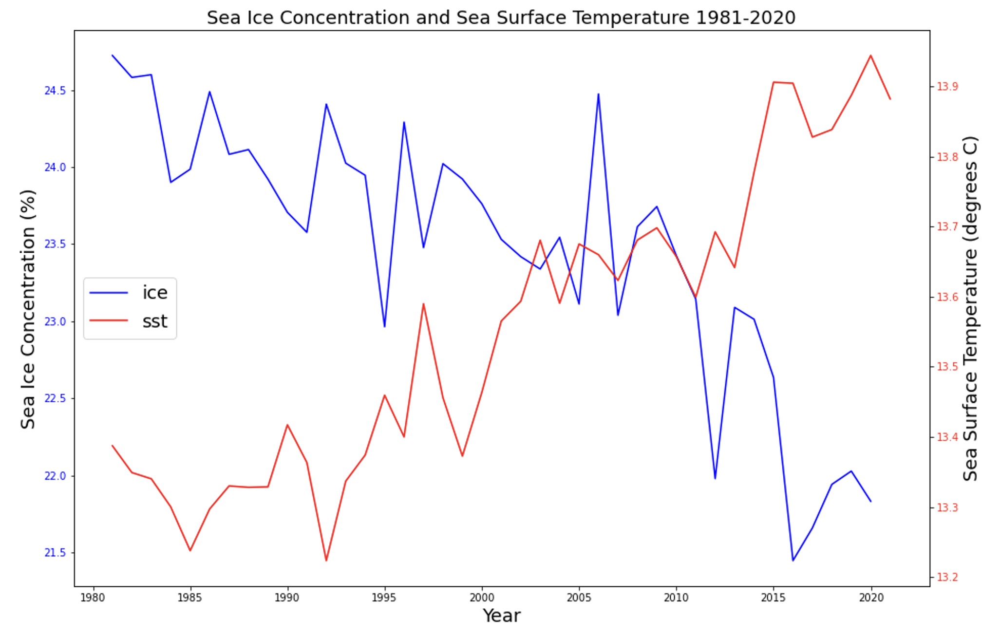

```{r setup, include=FALSE}
knitr::opts_chunk$set(echo = FALSE)
```

Plotting time series data from 2 different datasets can be tricky in Python. Here, we will plot sea surface temperature (SST) and sea ice concentration (SIC) in the same plot from the years 1981-2021 to visualize how climate change has impacted these environmental variables over time. 

## Datasets:

#### SST: NOAA's 1/4° Daily Optimum Interpolation Sea Surface Temperature (OISST) version 2, or OISSTv2\
- [Data source and metadata: NOAA National Centers for Environmental Information](https://www.ncei.noaa.gov/metadata/geoportal/rest/metadata/item/gov.noaa.ncdc:C00844/html)
- [NOAA Sea Surface Temperature Optimum Interpolation methods](https://www.ncei.noaa.gov/products/climate-data-records/sea-surface-temperature-optimum-interpolation)

#### SIC: Monthly Mean Hadley Centre Sea Ice and SST dataset version 1 (HadISST1)

- [Data source and metadata: UCAR/NCAR - DASH Repository](https://dashrepo.ucar.edu/dataset/158_asphilli.html)
- [Journal of Climate article explaining why the datasets were merged](https://journals.ametsoc.org/view/journals/clim/21/19/2008jcli2292.1.xml)

## Load necessary packages
`import xarray as xr`\
`import pandas as pd`\
`import matplotlib.pyplot as plt`\
`import glob`

## Import Sea Surface Temperature Data

I manually downloaded 40 years of datasets from the sea surface temperature data source, one day from each year (October 17th) and now I will import them with a for loop. Each dataset has a standardized name that only differs in the year it was collected, so the `glob()` function makes importing them all at once a piece of cake. We can use * as a wild card to represent any year in the file names.

`filenames = sorted(glob.glob('Data/oisst-avhrr-v02r01*'))`\
**#Use a for loop to open all data files as datasets (prior to this step, data files were manually pulled from source and stored locally)**\
**#Take the means of the 'lat' and 'long' because we want to decrease the quantity of this extraneous data so we can easily convert these datasets to dataframes**\
**#Converting the datasets to dataframes within this for loop will allow us to concatenate them and view the combined data in a way we can easily understand**\
`new = [xr.open_dataset(f).mean('lon').mean('lat').to_dataframe(dim_order=None) for f in filenames]`\
`df = pd.concat(new)`\
`df`


We need to organize the dataframe further before creating matplotlib visualizations for sea surface temperature over time. This dataframe defaulted to using time as an index, so we need to convert time to a column and subset the columns to just time and sea surface temperature.

## Sea Surface Temperature Dataframe Wrangling

**#Subset the columns: we choose only 'sst' here because 'time' is considered the index (note: subsetting this dataframe turns the type into a pandas 'series')**\
`df_subset = df['sst']`\
**#reset the 'time' from an index to a column**\
`sst_means = df_subset.reset_index()`\
**#subset to get rid of the useless variable "zlev"**\
`sst_means = sst_means[['time', 'sst']]`\
`sst_means`


Ensure that the type of the time variable is datetime64.


As a last step in processing this dataframe, we will pull the year out of the time variable. We do this because the day and time is consistent for each sea surface temperature file, and therefore it is negligible. Furthermore, will process the sea ice concentration data to only include year, and we need the sea surface temperature time variable to be of the same format as the sea ice concentration time variable.

**# add a column of just the year, so when we pair the sst data with the ice data, the time variable will match**
`sst_means['year'] = pd.DatetimeIndex(sst_means['time']).year`\
`sst_means`


## Plot Sea Surface Temperature Over Time

Now that we finished processing the sea surface temperature data, we can plot the sea surface temperature over our time period using `matplotlib` to see if can recognize a trend. It appears that sea surface temperature fluctuates over short time periods spanning a few years, but over the course of the full 40-year time period there is a clear positive correlation between time and temperature. This trend is what we would expect based on our knowledge of climate change and other sources of data that show rising sea temperatures across the globe.

`plt.figure(figsize=(10,7))`\
`plt.plot(sst_means['year'], sst_means['sst'], color='red')`\
`plt.xlabel('Year', fontsize=14)`\
`plt.ylabel('Sea Surface Temperature (degrees C)', fontsize=14)`\
`plt.title('Mean global Sea Surface Temperature in October between 1981 and 2020', fontsize=15)`


## Import Sea Ice Data

The sea ice data import process is similar to my code for importing the sea surface temperature data. One of my collaborators on this project, [Peter Menzies](https://petermenzies.github.io/), wrote the following code to import the sea ice data.

**# read in ice dataset with xarray (prior to this step, data files were manually pulled from source and compiled into a single local netCDF file)**\
`ds_ice = xr.open_dataset("Data/MODEL.ICE.HAD187001-198110.OI198111-202109.nc")`\

## Sea Ice Data Wrangling

**# create empty dataframe with columns year and ice_conc**\
`ice_time = pd.DataFrame(columns=['year', 'ice_conc'])`\
**# create empty lists to populate with values from dataset**
`ice_year = []`\
`ice_conc = []`\

Use another for loop to pull sea ice values from October of each year 1981 to 2020, and compile them in a dataframe:

`for i in range(0, 40):`\
    **# indexing the SEAICE attributes of our years of interest, finding the mean value, and outputting value as a float**\
    **# 1341 is the index for October 1981 - we need to add 12 in each iteration to get the month from the next year**\
    `ice_i = float(ice['SEAICE'][1341 + (12 * i)].mean())`\
    **# storing the year associated with ice concentration value**\
    `year_i = 1981 + i`\
    **# add year to list**\
    `ice_year.append(year_i)`\
    **# add ice concentration to list**\
    `ice_conc.append(ice_i)`

**# populated dataframe with the two lists as columns**\
`ice_time['year'] = ice_year`\
`ice_time['ice_conc'] = ice_conc`\
**# check out our resulting dataframe**
`ice_time`


## Plotting Sea Ice Data

`plt.figure(figsize=(10,7))`\
`plt.plot(ice_time['year'], ice_time['ice_conc'])`\
`plt.xlabel('Year', fontsize=14)`\
`plt.ylabel('Seaice concentration (%)', fontsize=14)`\
`plt.title('Mean global seaice concentration in October between 1981 and 2020', fontsize=15)`\


## Combine the Visualizations

Use `matplotlib` to combine the sea surface temperature and sea ice concentration data into one figure.

**# use the fig, ax method so that we have flexibility plotting each variable**\
`fig, ax = plt.subplots(figsize=(15,10))`\
**# assign a label to the ice data so we can reference it when we create the legend**\
`ice, = ax.plot(ice_time['year'], ice_time['ice_conc'], color='blue')`\
**# ax represents the axis for the ice data**\
`ax.tick_params(axis='y', labelcolor='blue')`\
`plt.xlabel('Year', fontsize = 18)`\
`ax.set_ylabel('Sea Ice Concentration (%)', fontsize = 18)`\
**# ax2 represents the axis for the sea surface temperature data**\
`ax2 = ax.twinx()`\
**# assign a label to the sst data so we can reference it when we create the legend**\
`sst, = ax2.plot(sst_means['year'], sst_means['sst'], color='red')`\
`ax2.tick_params(axis='y', labelcolor='red')`\
`ax2.set_ylabel('Sea Surface Temperature (degrees C)', fontsize = 18)`\
**# create an initial legend so that we can overwrite it with legend with both variables**\
`leg1 = ax.legend(loc='center left')`\
`leg2 = ax.legend([ice, sst],['ice','sst'], loc='center left', fontsize = 18)`\
`ax.set_title('Sea Ice Concentration and Sea Surface Temperature 1981-2020', fontsize = 18)`\
`plt.show()`



This plot and this code is just a portion of a larger environmental programming project completed by myself and my two collaborators [Peter Menzies](https://petermenzies.github.io/) and [Ryan Munnikhuis](https://ryanmunnikhuis.github.io/). See our complete repository [here](https://github.com/EDS220-Fall2021-org/Homework_3), which contains a binder in the README so anyone can run all the code with ease. Check out the anntoated code to learn how to turn these two datasets into rasterized images and GIF's!

Distill is a publication format for scientific and technical writing, native to the web.

Learn more about using Distill at <https://rstudio.github.io/distill>.


