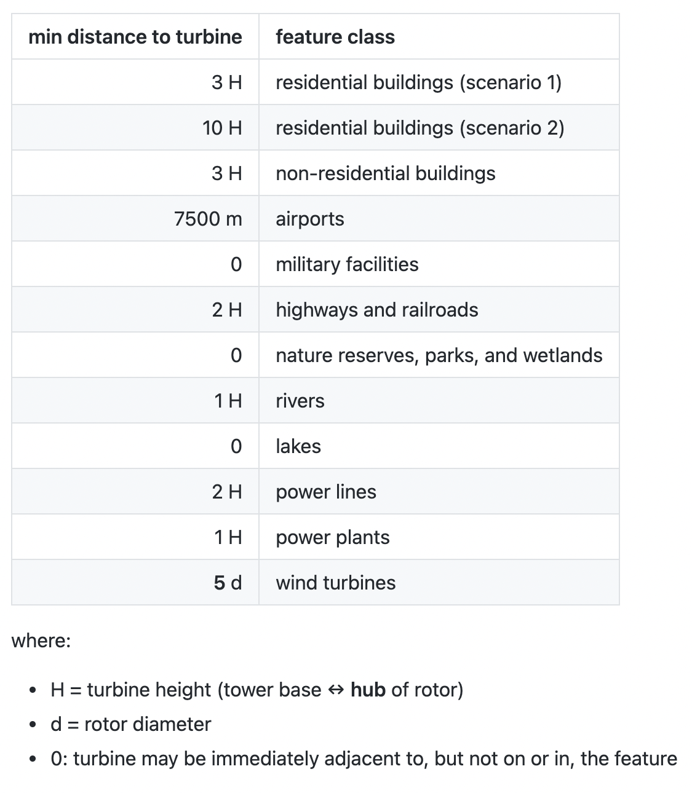
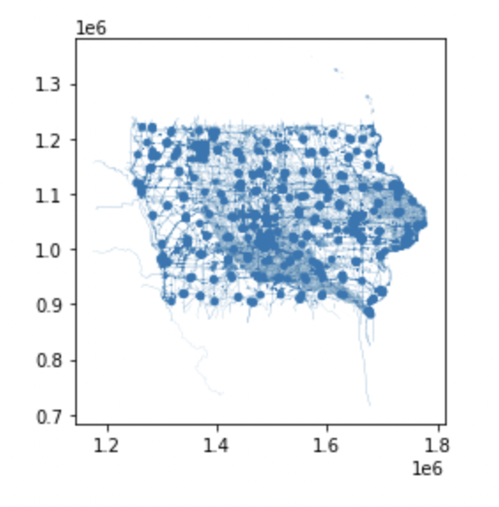

```{r setup, include=FALSE}
knitr::opts_chunk$set(echo = FALSE)
```


### Objective

Renewable energy is a rapidly growing industry in the United States, and we will only rely on it more over time. Wind energy collected by  turbines is a wonderful example of a green source of energy that can help America move towards a sustainable future. In order to make this dream a reality, our country must meticulously plan where we can place wind farms. We can use data science to determine how many wind turbines we can fit into certain plots of land while taking urban structures and natural protected spaces into account.

In particular, the state of Iowa has ideal environmental conditions for wind farms with its flat landscape and high, consistent wind speeds. This project aims to evaluate the maximum potential annual wind energy production available to the state of Iowa (meaning the quantity of megawatt hours that would be generated by placing as many 3.45 MW wind turbines as possible on all appropriate sites).

### Approach

This will be executed by first identifying all land suitable for wind turbine placement, subject to the siting constraints using Python, SQL, and PostGIS/OpenStreetMap. Subsequently, the area of each polygon suitable for wind production can be calculated, along with the number of wind turbines that could be placed in each polygon based on the minimum distance that they need to be from one another. This information will then be used to calculate the total annual energy production that would be realized by the maximum possible number of new turbines.

We will be hypothetically using [Vestas V136-3.45 MW turbines](https://us.vestas.com/en-us/products/4-mw-platform/V136-3-45-MW), which have a 150m hub height.

### Load Packages & Import Data

Our goal is to apply queries to a PostGIS database that contains Iowa's feature data from OpenStreetMap. In order to connect our Jupyter Notebook to the PostGIS database, we use the package `sqlalchemy`.   

```python
import sqlalchemy as sa
import geopandas as gpd
import numpy as np
import pandas as pd
import math
```

PostGIS Database Connection:
```python
pg_uri_template = 'postgresql+psycopg2://{user}:{pwd}@{host}/{db_name}'
db_uri = pg_uri_template.format(user='eds223_students', pwd='eds223', host='128.111.89.111', db_name='osmiowa')
engine = sa.create_engine(db_uri)
```
There are multiple tables in this engine. Shapefiles can take the form of points, lines, or polygons, and we need to query each of these types separately, so we need three separate PostGIS "connections".

```python
osm_polygons = gpd.read_postgis('SELECT * FROM planet_osm_polygon', con = engine, geom_col = 'way')
osm_lines = gpd.read_postgis('SELECT * FROM planet_osm_line', con = engine, geom_col = 'way')
osm_points = gpd.read_postgis('SELECT * FROM planet_osm_point', con = engine, geom_col = 'way')
# we use the column "way" because that is the title of the geometry column in this database
```
We also need to make a separate connection to the database to pull in the wind speed data for each geometry, which we will utilize at the end of our querying in order to calculate the wind power production:
```python
osm_wind = gpd.read_postgis('SELECT * FROM wind_cells_10000', con = engine, geom_col = 'geom')
```

### Queries for Siting Constraints

One cannot legally place wind turbines anywhere they please within the state of Iowa; there are restrictions in place that create restricted buffer zones around homes, airports, protected natural areas, and more. We need to adhere to these restrictions, only considering residential buildings buffer scenario 1:


Define important variables that you will utilize within the queries:
```Python
# H = turbine height (tower base ↔ tip of vertical rotor), in meters
H = 150
# this value can be found on the website for Vestas wind turbines, linked above

# distance required from airports, in meters
aero_dist = 7500

# d = rotor diameter, in meters
d = 136
# this value can be found on the website for Vestas wind turbines, linked above
```
## Subqueries

Separate queries are necessary for each feature, as each requires a different buffer zone around their geometries. We assign these SQL queries to Python objects, then we will combine them in the next step. We use the syntax `f"""` with triple quotes so we can format the code within the quotes with variables and line breaks for vertical organization.

```python
# use scenario 1 with 3*H serving as the required distance
sql_buildings_residential = f"""SELECT osm_id, building, landuse, aeroway, military, highway, railway, leisure, "natural",
water, waterway,
ST_BUFFER(way, 3 * {H}) as way 
FROM planet_osm_polygon 
WHERE building IN ('yes', 'residential', 'apartments', 'house', 'static_caravan', 'detached')
OR landuse = 'residential'
OR place = 'town'"""

sql_buildings_non_residential = f"""SELECT osm_id, building, landuse, aeroway, military, highway, railway, leisure, "natural",
water, waterway,
ST_BUFFER(way, (3 * {H})) as way
FROM planet_osm_polygon 
WHERE building NOT IN ('residential', 'apartments', 'house', 'static_caravan', 'detached')"""

sql_aeroway = f"""SELECT osm_id, building, landuse, aeroway, military, highway, railway, leisure, "natural",
water, waterway,
ST_BUFFER(way, {aero_dist}) as way
FROM planet_osm_polygon 
WHERE aeroway IS NOT NULL"""

sql_military = f"""SELECT osm_id, building, landuse, aeroway, military, highway, railway, leisure, "natural",
water, waterway, way
FROM planet_osm_polygon
WHERE (landuse = 'military') 
OR military IS NOT NULL"""

sql_highway = f"""SELECT osm_id, building, landuse, aeroway, military, highway, railway, leisure, "natural",
water, waterway,
ST_BUFFER(way, (2 * {H})) as way
FROM planet_osm_line 
WHERE (railway NOT IN ('abandoned', 'disused')) 
OR highway IN ('motorway', 'trunk', 'primary', 'seconday', 'primary_link', 'second

sql_leisure = f"""SELECT osm_id, building, landuse, aeroway, military, highway, railway, leisure, "natural",
water, waterway, way
FROM planet_osm_polygon
WHERE leisure IS NOT NULL 
OR "natural" IS NOT NULL"""

sql_river = f"""SELECT osm_id, building, landuse, aeroway, military, highway, railway, leisure, "natural",
water, waterway,
ST_BUFFER(way, (1 * {H})) as way
FROM planet_osm_line 
WHERE waterway IS NOT NULL"""

sql_lake = f"""SELECT osm_id, building, landuse, aeroway, military, highway, railway, leisure, "natural",
water, waterway, way 
FROM planet_osm_polygon 
WHERE water IS NOT NULL"""

sql_power_lines = f"""SELECT osm_id, building, landuse, aeroway, military, highway, railway, leisure, "natural",
water, waterway,
ST_BUFFER(way, (2 * {H})) as way
FROM planet_osm_line
WHERE power IS NOT NULL"""

sql_power_plants = f"""SELECT osm_id, building, landuse, aeroway, military, highway, railway, leisure, "natural",
water, waterway,
ST_BUFFER(way, (1 * {H})) as way
FROM planet_osm_polygon 
WHERE power IS NOT NULL"""

sql_wind_turbines = f"""SELECT osm_id, building, landuse, aeroway, military, highway, railway, leisure, "natural",
water, waterway,
ST_BUFFER(way, (5 * {d})) as way
FROM planet_osm_point
WHERE "generator:source" IS NOT NULL"""
```

### Mega-Query

Combine the subqueries into one mega-query so we can subtract all these restricted geometries as one unit. These subtracted geometries can be considered a "mask" in the world of spatial data science.

```python
mask_1 = f"""{sql_buildings_residential}
UNION
{sql_buildings_non_residential}
UNION
{sql_aeroway}
UNION
{sql_military}
UNION
{sql_highway}
UNION
{sql_leisure}
UNION
{sql_river}
UNION 
{sql_lake}
UNION 
{sql_power_lines}
UNION 
{sql_power_plants}
UNION
{sql_wind_turbines}"""

mask_1_df = gpd.read_postgis(mask_1, con = db_uri, geom_col = 'way')

# take a look at the state of Iowa without this "mask" of geometries
mask_1_df.plot()
```


### Wind Data

Subtract the union of the string constraints from the wind cells so we are left with only those (fractions of) cells that could accommodate new wind turbines. These are "suitable cells".

```python
suitable_cells_1 = osm_wind.overlay(mask_1_df, how = 'difference')

#Find area of each suitable cell/geom in the database
suitable_cells_1['suitable_cell_area'] = suitable_cells_1.geom.area
```
Now we can calculate the area of the turbine footprint as a circle with a radius of 5 rotor diameters, with the goal of calculating a scenario in which turbine towers must be at least 10 rotor diameters apart.

Calculate a buffer circle around each wind turbine, called a "turbine footprint".
```python
turbine_footprint = math.pi*((5*d)**2)
```
Calculate the number of wind turbines that could be placed in each polygon, by dividing each suitable cell by the turbine footprint.

```python
suitable_cells_1['n_turbines'] = suitable_cells_1['suitable_cell_area'] / turbine_footprint
```

Calculate the total wind energy produced per cell by multiplying the amount of turbines in each suitable cell by the annual wind production for each turbine.

**Formula:**\
**E** = **2.6** s m-1 v + **-5** GWh\
**E** = energy production per turbine in GWh\
**v** = average annual wind speed in m s-1\

```python
suitable_cells_1['energy_prod_per_cell'] = suitable_cells_1['n_turbines'] * ((2.6 * suitable_cells_1['wind_speed']) - 5)
```

### Results

Sum the energy production over all the cells into a single statewide number for residential exclusion distance scenario 1.

```python
total_energy_product_1 = sum(suitable_cells_1['energy_prod_per_cell'])
```

The maximum annual potential wind energy production available to the state of Iowa is 1036574.26 GWh.

### Acknowledgements

- I would like to thank my partner on this project, [Sydney Rilum](https://bren.ucsb.edu/people/sydney-rilum) from the Bren School of Environmental Science and Management, for her contributions. I will never forget the hours we spent drawing widn turbine circles on paper and adjusting the mathematical calculations to refelct different rotor diameters and how that changes the wind power potential for the state of Iowa.

- [wind turtbine photo source](https://newscenter.lbl.gov/2021/08/30/technology-advancement-and-value-of-wind-energy/)


