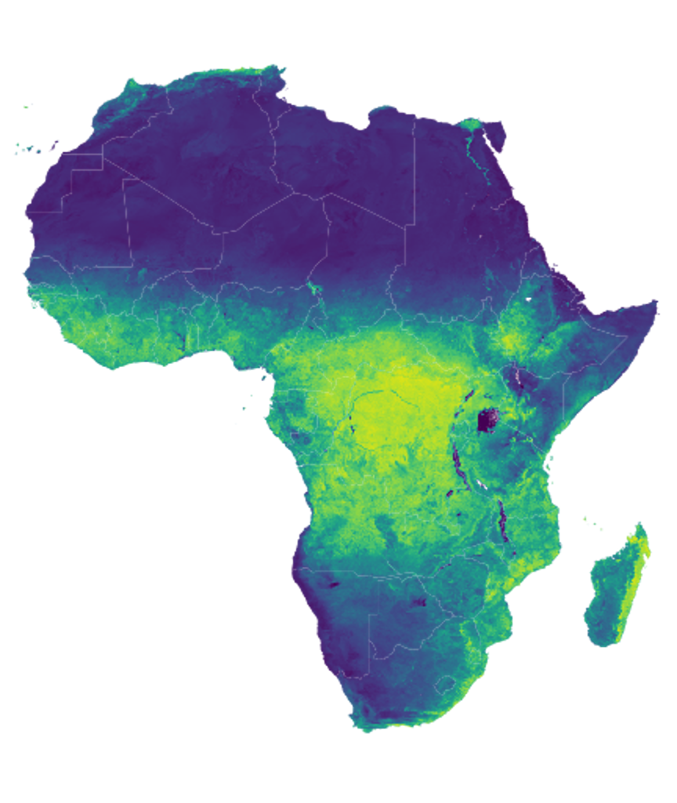
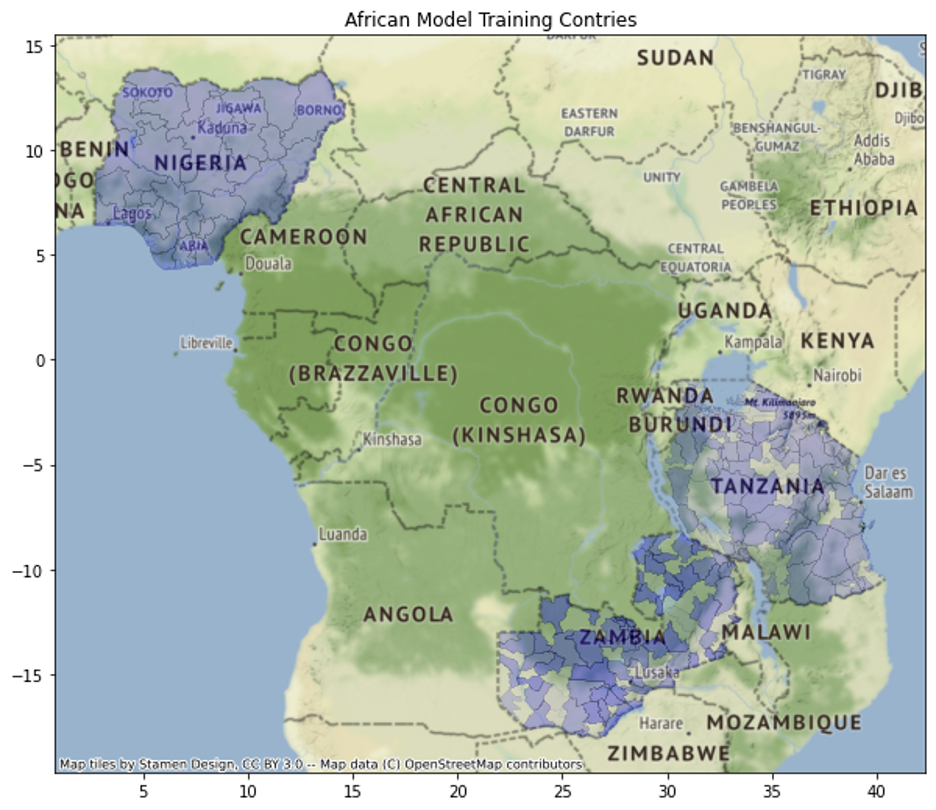
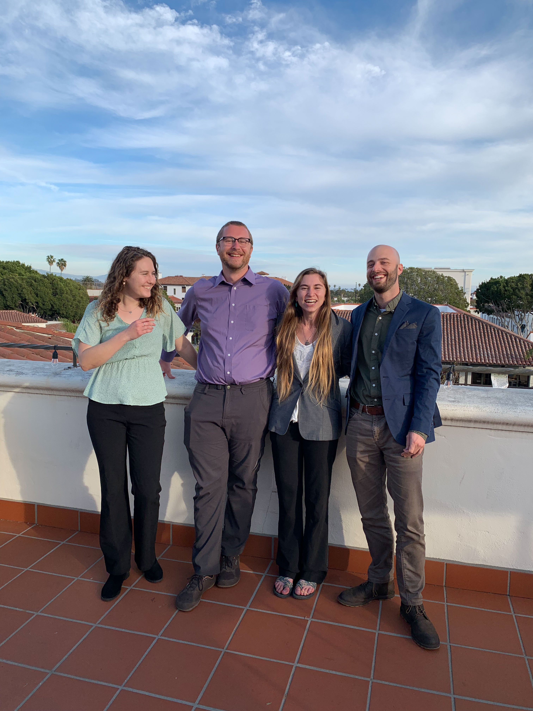
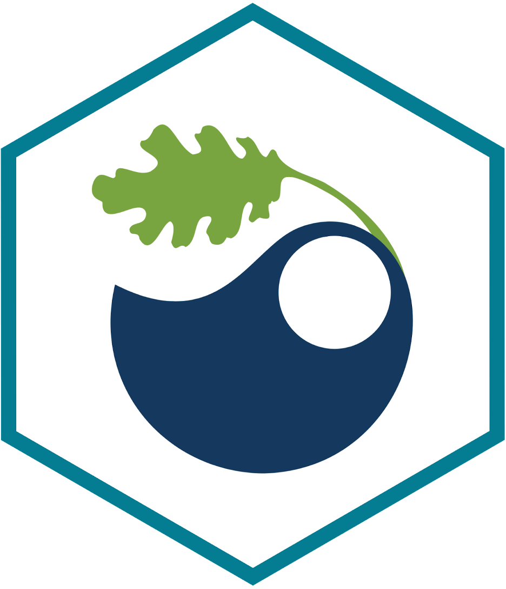
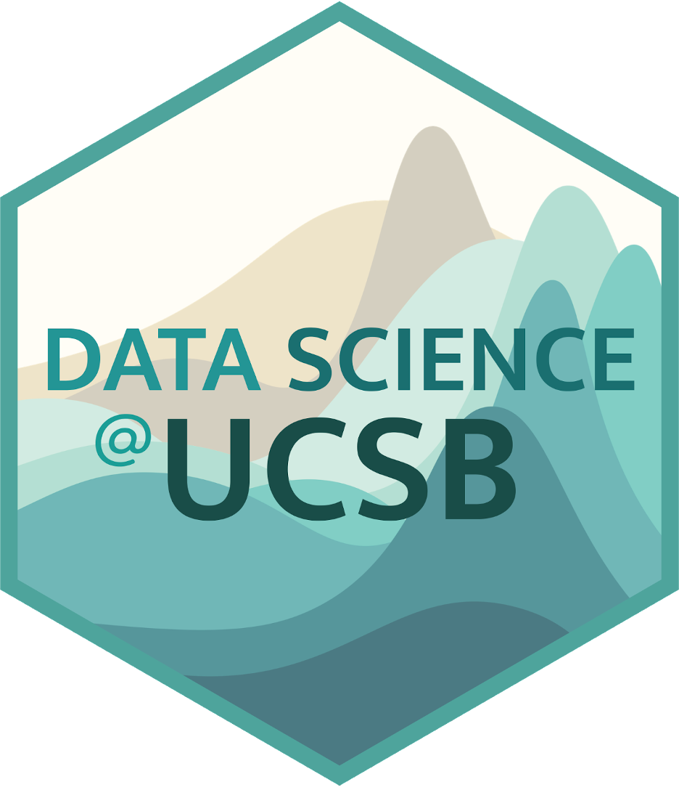
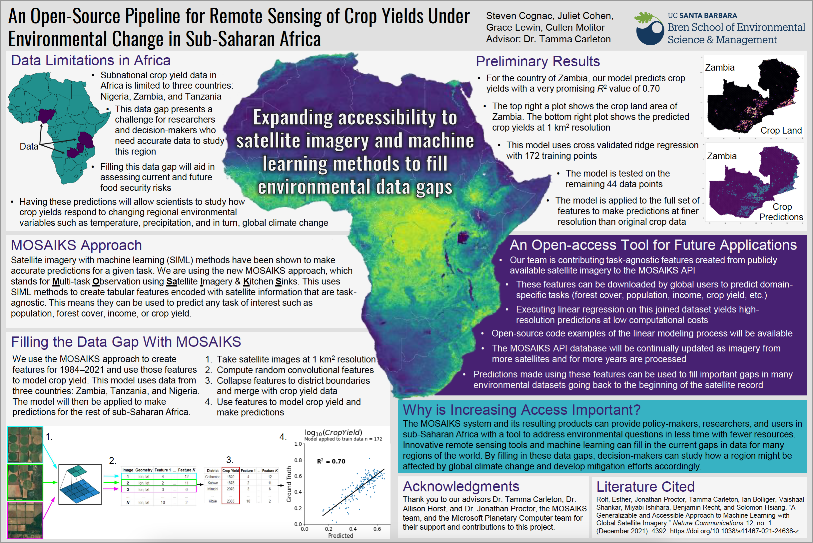

```{r setup, include=FALSE}
knitr::opts_chunk$set(echo = FALSE)
```

## An open-source pipleline for remote sensing of crop yields under environmental change in sub-Saharan Africa

<center>

{width=50%}{width=50%}

</center>

As a student in the Master of Environmental Data Science program at the Bren School of Environmental Science and Management, I am working on a capstone project aiming to create an open-source tool to predict crop yields over time in sub-Saharan Africa using remote sensing techniques. My teammates are Grace Lewin, Cullen Molitor, and Steven Cognac, and our advisor is Dr. Tamma Carleton from the Bren School and the [MOSAIKS team at the Global Policy Lab](http://www.globalpolicy.science/mosaiks). We are a collaborative group of data scientists interested in the relationship between environmental trends and food security in regions of the world that suffer from data scarcity. I am very fortunate to be a part of this wonderful team working towards a better understanding of environmental implications on human well-being. 

**The MOSAIKS capstone team:**

<center>

{width=70%}

</center>

### ABSTRACT: 

The environmental and social impacts of climate change are disproportionately distributed worldwide. Many highly impacted regions lack the assets to monitor and generate resource predictions, and therefore lack high-quality environmental and social data. As a result, it is difficult to make predictions about the impacts of climate change for these regions using conventional modeling. Recently, machine learning approaches applied to high-resolution satellite imagery have been successful in making predictions of a wide range of social and environmental variables. However, generating these predictions comes with significant barriers, including high computational, data storage, expertise, and financial resource costs. Reducing the financial and computational burden of machine learning approaches is essential to increasing the equity of environmental monitoring processes and outputs. Sub-Saharan Africa is one of these data-limited regions and is likely to suffer some of the largest impacts from climate change globally. To enable increased monitoring and data access across the sub-continent, we apply the novel machine learning approach, MOSAIKS, to create tabular features for sub-Saharan Africa using satellite imagery. These features, paired with ground-truth crop data from three countries, will be used to build a model that predicts crop yields over time in regions without crop data. This model will provide new insights into the historical crop yields of the region. Furthermore, these tabular features of satellite imagery, and the methodology developed to create them, will enable more people around the globe to build models and generate predictions of other social and environmental variables in this region.

<center>

{width=20%}{width=20%}

</center>

### New Horizons in Conservation Conference 2022 - Yale School of the Environment

My teammates and I were invited to attend the [New Horizons in Conservation Conference 2022 at the Yale School of the Environment](https://jedsi.yale.edu/new-horizons-conference/2022-conference). Having the opportunity to participate in this conference is an honor and a privilege. We are grateful to the Yale School of the Environment for showing interest in our project and giving us the chance to explore how other equity-driven scientists are expanding the horizons of the data world.

**My teammates and I are very passionate about the tool and data products we are contributing to the remote sensing field. We hope other scientists and  users will be able to improve upon it in the future, especially as we expect to face more extreme climate fluctuations moving forward with climate change.**

As part of our participation in this conference, we created a video and poster to share our progress as well as our vision for the end products. We look forward to showcasing this novel open-source tool that will hopefully increase access to powerful remote sensing products.

### The MOSAIKS API

Moving forward, we aim to contribute our data, code, and instructional documentation to the [MOSAIKS API](https://nadar.gspp.berkeley.edu/home/index/?next=/portal/index/). This user-friendly API will allow anyone to access our data and use it for their needs. Users may take the form of environmental policy-makers, politicians involved in food security in sub-Saharan Africa, researchers interested in environmental or socioeconomic trends, or anyone else! The interface allows users to download "feature data" for any place on earth and run analysis over space and time, for any task of interest, given that the data is available for that region.

The MOSAIKS API database contains geolocated data files with task-agnostic "features" for many regions of the world. These features are satellite image data converted to meaningful numbers through a mathematical process called "random convolutional featurization." This approach is a subset of unsupervised deep learning that is praised for its accuracy and computational efficiency. Users can access this tabular feature data and run statistical analysis (such as ridge regression) to answer their environmental and socioeconomic questions.

### What is a task of interest?

An example of a task is determining how a characteristic of the landscape changes over time, such as how forest cover changes in the Congo or how wetland habitat fluctuates. Satellite images can help us understand these trends, and a single set of feature data is task-agnostic because the features were originally created using unsupervised machine learning, and the MOSAIKS model is then trained on those features and task-specific data using supervised machine learning. Detailed Jupyter notebooks hold the user's hand as they execute adapt Python code to fit their task's needs and expand the horizons beyond what they ever thought was possible with remote sensing data.**

### View this 3-minute video to learn more about our project's objective, approach, and how it relates to equity and inclusion in the world of environmental data science:

<center>

{width=99%}

</center>

### How does this remote sensing tool increase equity in the field of environmental data science?

The MOSAIKS system and its resulting products can provide policy-makers, researchers, and users in
sub-Saharan Africa with a tool to address environmental questions in less time with fewer resources.
Innovative remote sensing tools and machine learning can fill in the current gaps in data for many
regions of the world. By filling in these data gaps, decision-makers can study how a region might be
affected by global climate change and develop mitigation efforts accordingly. With this tool, countries can compare environmental trends on a broader scale, establish collaborative food security policies, and fight climate change from well-informed perspectives.

<center>

{width=99%}

</center>

If you are interested in learning more about this project, or if you have suggestions to improve our methodology or data products, please feel free to contact my team at **cp-cropmosaiks.bren.ucsb.edu** or create an issue on our github organization, [cropMOSAIKS](https://github.com/cropmosaiks). Thank you for reading, and happy coding!


