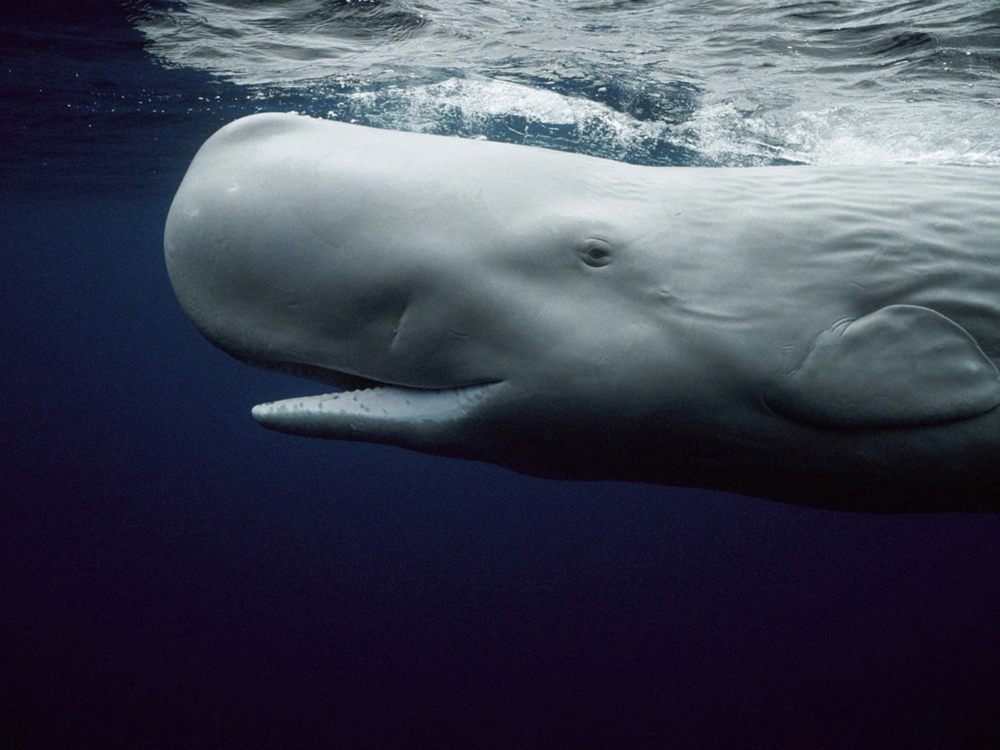
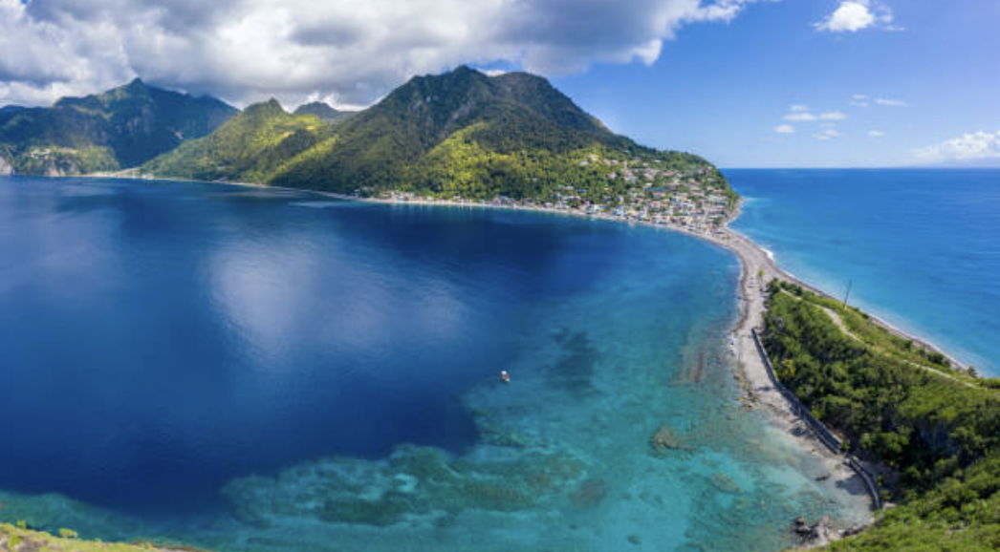
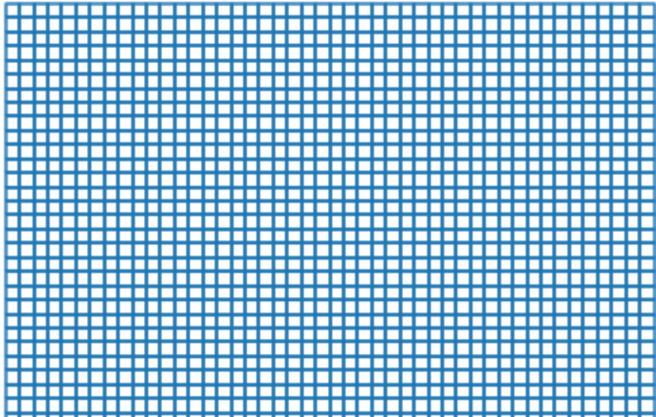
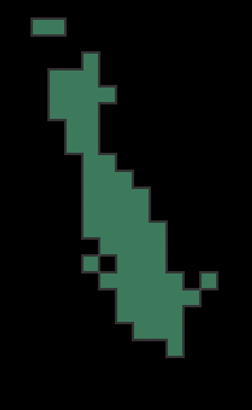
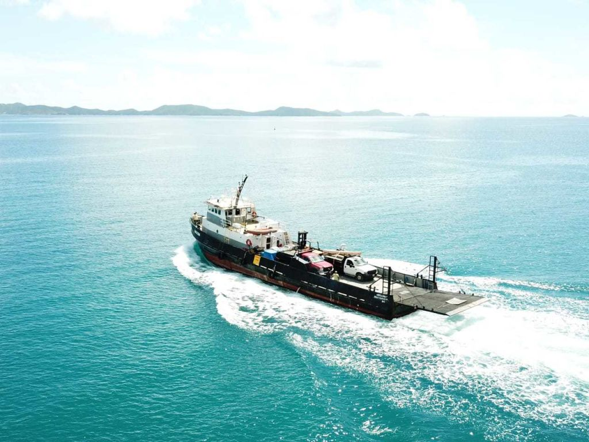

```{r setup, include=FALSE}
knitr::opts_chunk$set(echo = FALSE)
```

## Protecting Whales from Ships

In this Python analysis, we aim to determine the optimal spatial outline of a speed reduction zone for boats in Dominica, an island country in the Caribbean that is well-known for its year-round sperm whale population ([source](https://discoverdominica.com/en/lists/35/whale-watching#:~:text=Dominica%20is%20the%20only%20country,the%20calm%20turquoise%20Caribbean%20Sea.)). We do this by creating a grid across Dominica's seascape where each cell represents the number of reported whale sightings in that subregion. We then use automatic identification system data to track the vessel movement in this same region. Lastly, we calculate the effect of a hypothetical speed reduction zone on the local traffic.

<center>

{width=60%}

</center>

##### "Whales are among the largest creatures on earth and play vital roles in maintaining healthy underwater ecosystems. Yet, intensive whaling over the past 200 years has brought many populations to the brink of extinction, and today many species remain threatened or endangered. Although hunting has decreased dramatically over the last century, another danger threatens whales – massive cargo ships. Whale-ship collisions are currently a leading cause of death for large whales, and scientists estimate that over 80 blue, humpback, and fin whales are killed by vessel collisions on the West Coast of the United States each year ... As global maritime traffic continues to increase, it is critical that we implement solutions now to protect endangered whales."    - [Whale Safe, Benioff Ocean Initiative](https://boi.ucsb.edu/active_projects/whale-strikes)

<center>

{width=70%}

</center>

Let's open up a fresh Jupyter Notebook and get started investigating the intersection of whale migration and human marine traffic in Dominica. 

### Load packages
```python
import geopandas as gpd
import matplotlib.pyplot as plt
import pandas as pd
import numpy as np
from shapely.geometry import Polygon
import datetime as dt
```

### Read in two data files:

1. A spatial data file that defines the boundaries of Dominica, the island country in the Caribbean where our ship & whale investigation takes place.\
2. Whale sightings data, which contains times and locations of approximately 5,000 whale sightings in Dominica between 2008 and 2015.
```python
# import dominca's spatial data as a geodataframe
dominica_outline = gpd.read_file('data/dominica/dma_admn_adm0_py_s1_dominode_v2.shp')

# import sightings as a geodataframe 
sightings = gpd.read_file('data/sightings2005_2018.csv')
```

Set the coordinate reference systems we will use in this analysis: 
```python
projected_EPSG = 2002   # Dominica 1945 / British West Indies Grid
geodetic_EPSG  = 4326   # WGS 84 (use as default CRS for incoming lat & lon)

# switch to crs 2002
dominica_outline = dominica_outline.to_crs(projected_EPSG)
dominica_outline
```

<center>

{width=20%}
</center>

### Whale Sightings Data

Bootstrap the geometries from the latitude & longitude and set the CRS to `EPSG 4326` initially, and we will convert it to `EPSG 2002` when we are done appending the geometries. This 2-step process ensures that the latitude and longitude are projected correctly. 
```python
sightings_geom = gpd.points_from_xy(x = sightings.Long, 
                                    y = sightings.Lat, 
                                    crs = geodetic_EPSG)

# append the geometries to the sightings data
sightings = sightings.set_geometry(sightings_geom)

# set CRS to local EPSG
sightings = sightings.to_crs(epsg = projected_EPSG)
```
### Create Grid

Create a basic grid object that will be the starting point for the oceanic grid around Dominica that will be tailored to whale habitat:
```python
fig, ax = plt.subplots(figsize=(3, 3), 
                       dpi=200)
ax.grid(True)
```

<center>

{width=20%}

</center>

Determine the minimum and maximum `x` and `y` bounds of all sightings using the `.total_bounds` function:
```python
minx, miny, maxx, maxy = sightings.total_bounds
minx, miny, maxx, maxy
# total_bounds in meters:
# (408480.65208368783, 1532792.7459409237, 498500.3049570159, 1796964.399702923)
```

Create `arrays` of the indices of our grid, with the values denoting the southwest corner of each grid cell. The syntax here is pretty abstract, but it gets the job done. The `2000` argument represents the quantity of meters in each direction:

```python
# the grid cell dimensions are 2000 meters in both the x and y direction
xs = np.arange(minx, 
               maxx, 
               2000)
               
ys = np.arange(miny, 
               maxy, 
               2000)
               
# convert the corner points into proper cell polygons
def make_cell(x, y, cell_size):
    ring = [
        (x, y),
        (x + cell_size, y),
        (x + cell_size, y + cell_size),
        (x, y + cell_size)
    ]
    cell = Polygon(ring)
    return cell
    
# iterate over each combination of x and y coordinates in a nested for loop
cells = []
for x in xs:
    for y in ys:
        cell = make_cell(x, y, 2000)
        cells.append(cell)

grid = gpd.GeoDataFrame({'geometry': cells}, 
                        crs = projected_EPSG)
                        
# plot the grid and increase the figure size to 20, 20 to better visualize without a fill color
grid.boundary.plot(figsize=(20,20))
```

<center>

{width=30%}

</center>

### Extract Whale Habitat

Execute an inner spatial join of the sightings data, with the grid being the first dataset named because we want the output to be in grid cells rather than points:
```python
# the join produces a row for each intersection of each grid cell with each sighting
joined = grid.sjoin(sightings, 
                    how = "inner")
                    
# plot the whale habitat in the form of cells
joined.plot(figsize = (15, 15))
```
<center>

{width=15%}

</center>

Group the rows of the joined dataset to be able to count the number of whale sightings per cell:
```python
grid['count'] = joined.groupby(joined.index).count()['index_right']
joined
```

Count the minimum and maximum number of whales observed in the grid cells to get an idea of the range of observations over space:
```python
# check the max count of whales in 1 cell
max_count = grid['count'].max()
# check the minimum count of whales in 1 cell
min_count = grid['count'].min()

# check the unique values in the count column to get an idea about the range of the sightings per cell
grid['count'].unique()
```

<center>

{width=40%}

</center>

Subsample the grid cells for only those with 20 or more observations, because when defining protected species habitat we should prioritize protecting the subregions that are more densely populated:
```python
# fitler the data for only sightings that included more than 20 whales
grid_subset = grid[grid['count'] > 20]
```

Execute a `unary union` and take the convex hull of that union to determine a comprehensive speed reduction zone. Next, take the `convex hull` of the `unary union` in order to desginate the speed reduction zone, essentially rounding out the cell polygons from the `unary union`.
```python
# unary union
grid_subset_union = grid_subset.unary_union
grid_subset_union
```

<center>

{width=20%}

</center>

```python
# convex hull
grid_subset_hull_poly = grid_subset_union.convex_hull
grid_subset_hull_poly
```

<center>

{width=20%}

</center>

Convert grid_subset_hull to a geodataframe with the local CRS for Dominica; `EPSG 2002`
```python
grid_subset_hull_gdf = gpd.GeoDataFrame(index=[0], 
                                        crs= projected_EPSG, 
                                        geometry=[grid_subset_hull_poly])
```

### Plot the Speed Reduction Zone

Now that we have determined the grid cells with whale sightings around Dominica, lets move on to defining the ideal speed reduction zones for ships in this region. Cargo ships, large fishing vessels, and ecotourism vessels all pose a threat to whales. If the ships travel slower and are more vigilant of the surrounding marine life, perhaps we can find a middle ground in which whales can safely feed, raise their young, and migrate alongside humans in the marine region around Dominica. To make this compromise, we aim to determine the portion of the seascape that is most critical to reduce speed, rather than trying to restrict speeds everywhere, which is unrealistic as it would be impossible to regulate. Furthermore, if whales are not observed often in a certain region of the ocean, restricting speeds there would be more disruptive to human livelihoods than beneficial to whale movement. 

```python
fig, ax = plt.subplots(figsize = (4,4), 
                       dpi = 200)
ax.set_facecolor('xkcd:lightblue')
grid_subset_hull_gdf.plot(ax = ax, 
                          facecolor = 'None')
dominica_outline.plot(ax = ax, 
                      facecolor = "green")
plt.title('Speed Reduction Zone for Whales Near Dominica', 
          y = 1.04)
plt.xlabel('Latitude (meters)')
plt.ylabel('Longitude (meters)')
```

<center>

{width=30%}
</center>

Now we have completed the whale habitat delineation!

### Vessel Data 

Marine commercial vessels or any vessel of at least 300 gross tonnage are required to be fitted with an "automatic identification system" receiver to monitor their movement. The beacons emitted from these transmitters are received, encoded, and archived by terrestrial stations.

<center>

{width=60%}

</center>

Similarly to how we used whale sightings to determine the spatial extent of whale habitat, we will use temporal and spatial aspects of automatic identification system data to determine vessel speeds in the same region.

Source of automatic identification system data from vessels in 2015: the [Dominica Sperm Whale Project](https://www.thespermwhaleproject.org/)

[Source of automatic identification system data for vessels worldwide](https://www.vesselfinder.com/)

Read in the vessel data:
```python
vessel = gpd.read_file('data/station1249.csv')
```

Similarly to what we processed the spatial sightings data, here we bootstrap the vessel geometries from the latitude & longitude and initially set the CRS to `EPSG 4326`. We will convert it to the local `EPSG 2002` after we append the geometries:
```python
vessel_geom = gpd.points_from_xy(x = vessel.LON, 
                                 y = vessel.LAT, 
                                 crs = geodetic_EPSG)
# this generated a geometry array of shapely point geometries from coordinates

# finish bootstrpping the geometries by appending this geoseries to the whales dataset
vessel = vessel.set_geometry(vessel_geom)
vessel
```
<center>

{width=80%}

</center>

```python
# set the local CRS
vessel = vessel.to_crs(projected_EPSG)

# visualize the raw vessel points
vessel.plot()
```

<center>

{width=20%}

</center>

Subset the vessel data for only the vessels within the area of interest and format the data to prepare for temporal and spatial calculations:
```python
vessel = vessel[vessel.intersects(grid_subset_hull_poly)]

# set the TIMESTAMP column to type datetime
vessel['TIMESTAMP'] = pd.to_datetime(vessel['TIMESTAMP'], 
                                     format = '%Y-%m-%d %H:%M:%S')
```

### Calculate Distance and Speed of Vessels

We will calculate the distance between two successive locations of the same vessel, as well as the time difference between the time stamps of those two locations. We will use the tried and true equation we have memorized from middle school:\
`distance = rate * time` 

First, sort the vessels by their Maritime Mobile Service Identity (MMSI), which is a unique identification number for each vessel:
```python
vessel_sorted = vessel.sort_values(["MMSI", "TIMESTAMP"], 
                                   ascending = True)

# create a copy of the raw data because we need to shift the columns in the working copy
# we are trying to match 2 timestamps and their respective locations to each singular vessel    
vessel_sorted_copy = vessel_sorted.shift()

vessel_joined = vessel_sorted.join(vessel_sorted_copy, 
                                   lsuffix = '_end', 
                                   rsuffix = '_start')
                                   
# drop rows in which the MMSI_start does not match MMSI_end, because we can only compare time stamps from the same vessel
vessel_joined_mmsi_match = vessel_joined[vessel_joined['MMSI_start'] == vessel_joined['MMSI_end']]

# take a look at the dataframe now that it is prepped for speed calculations
vessel_joined_mmsi_match
```
<center>

{width=80%}
</center>

Clean up the dataframe geometries:
```python
# reset one of the geometry columns as a geometry type, because the geodataframe only needs 1 geom column specified
vessel_joined_mmsi_match = vessel_joined_mmsi_match.set_geometry('geometry_start')
vessel_joined_mmsi_match.crs
# note: we are still able to do spatial operations with BOTH geometry columns because they are both shapely objects
```

Calculate the distance between successive locations for each vessel, using the MMSI:
```python
vessel_joined_mmsi_match['distance_m'] = vessel_joined_mmsi_match.distance(vessel_joined_mmsi_match['geometry_end'])
```

Calculate the time difference for each vessel from one observation to the next by subtracting one time stamp from the other:
```python
vessel_joined_mmsi_match['time_diff'] = (vessel_joined_mmsi_match['TIMESTAMP_end'] - vessel_joined_mmsi_match['TIMESTAMP_start'])
```

Calculate the average speed in meters per second using (distance) = (rate)*(time):
```python
# divide the distance column by the time_diff column
# use the function `total_seconds()` to get the time in units of seconds
vessel_joined_mmsi_match['speed_m_s'] = vessel_joined_mmsi_match['distance_m']/vessel_joined_mmsi_match['time_diff'].dt.total_seconds()
```

What is the time that the distance would have taken at 10 knots? `1 knot = 1 nautical mile`, so we convert our meters to nautical miles and then convert the time to hours.
```python
# convert distance column units from meters to miles
meters_per_nm = 1852.0
vessel_joined_mmsi_match['distance_nm'] = vessel_joined_mmsi_match['distance_m']/meters_per_nm
vessel_joined_mmsi_match

# divide the distance by 10 since we are travelling at 10 times the speed, then multiply that output by 3600 because we want units of seconds 
vessel_joined_mmsi_match['time_10_nm_s'] = vessel_joined_mmsi_match['distance_nm']/10*3600
```

Calculate the difference between the time that it actually took and how much it would have taken at 10 knots:
```python
# subtract the actual time from the predicted time at 10 knots, because we want to figure out how much MORE time would be spent if every vessel traveled at 10 knots
vessel_joined_mmsi_match['time_diff_actual_vs_10k'] = (vessel_joined_mmsi_match['time_10_nm_s']) - vessel_joined_mmsi_match['time_diff'].dt.total_seconds()
# we want to be able to filter out the differences in times for boats that went SLOWER than 10 knots, we don't want to sum EVERY time difference
```

Filter for the times that are greater than zero, because we only want to calculate the extra time that is spent by those boats that were going faster than 10 knots that would slow to 10 knots. We do not want to consider the boats that were already travelling slower than this speed:
```python
vessel_joined_mmsi_match = vessel_joined_mmsi_match.loc[vessel_joined_mmsi_match['time_diff_actual_vs_10k']>0]
```

Sum up the time difference values and convert the units from seconds to days:
```python
sum(vessel_joined_mmsi_match['time_diff_actual_vs_10k']/ 60/60/24)
```

The difference between the time that it actually took and how much it would have taken at 10 knots is approximately 27.87 days, on average. Mission accomplished.

Can we use this analysis to help support a policy change in Dominica to enforce a speed reduction zone and protect the vulnerable sperm whale population? Future investigation of this data might include diving into the MMSI codes for the vessels to determine which vessels are speeding more often, revealing which vessels should be targeted in this policy. Additionally, after such a policy is put into place, we can compare the whale sightings afterward to those before, and hopefully see an increase in whale activity!

### Acknowledgements

- I would like to thank my collaborator on this project, [Sydney Rilum](https://bren.ucsb.edu/people/sydney-rilum) from the Bren School of Environmental Science and Management, for her contributions. I will always remember the excessive amount of time we spent googling coordinate reference systems, adjusting our vessel speed calculations, and iterating through different grid cell sizes. 

- Thank you, Dr. James Frew and Niklas Griessbaum from the Bren School of Environmental Science and Management, for prompting us to investigate this question. Your expertise in spatial data science continues to inspire me to answer more questions like this in my future career.

Thank you for following along with this analysis, and please contact me with any suggestions or comments at my GitHub page [here](https://github.com/julietcohen) or via email (jscohen@bren.ucsb.edu)

### Related Resources

If you are interested in acoustic whale monitoring in the Caribbean, check out [this paper by Heenehan el al. 2019](https://www.frontiersin.org/articles/10.3389/fmars.2019.00347/full) that discusses Caribbean soundscapes of these magnificent marine mammals and anthropogenic influences that challenge their survival. 

If you are interested in exploring how migratory whales and human vessels are being tracked and regulated in the Santa Barbara Channel, please check out the novel [Whale Safe mapping and analysis tool](https://whalesafe.com/) from the Benioff Ocean Initiative! You can also subscribe to their weekly emails to stay up-to-date with recent visual and acoustic whale detections of all the species that live in the Channel. 

### Photo Sources:

[sperm whale photo](https://www.smithsonianmag.com/smart-news/your-high-end-perfume-likely-part-whale-mucus-180958767/)

[Scotts Head, Dominca](https://www.istockphoto.com/photos/dominica)

[cargo vessel](https://www.overstockboats.com/classifieds/110-ro-ro-cargo-vessel-in-caribbean-o749.html)
