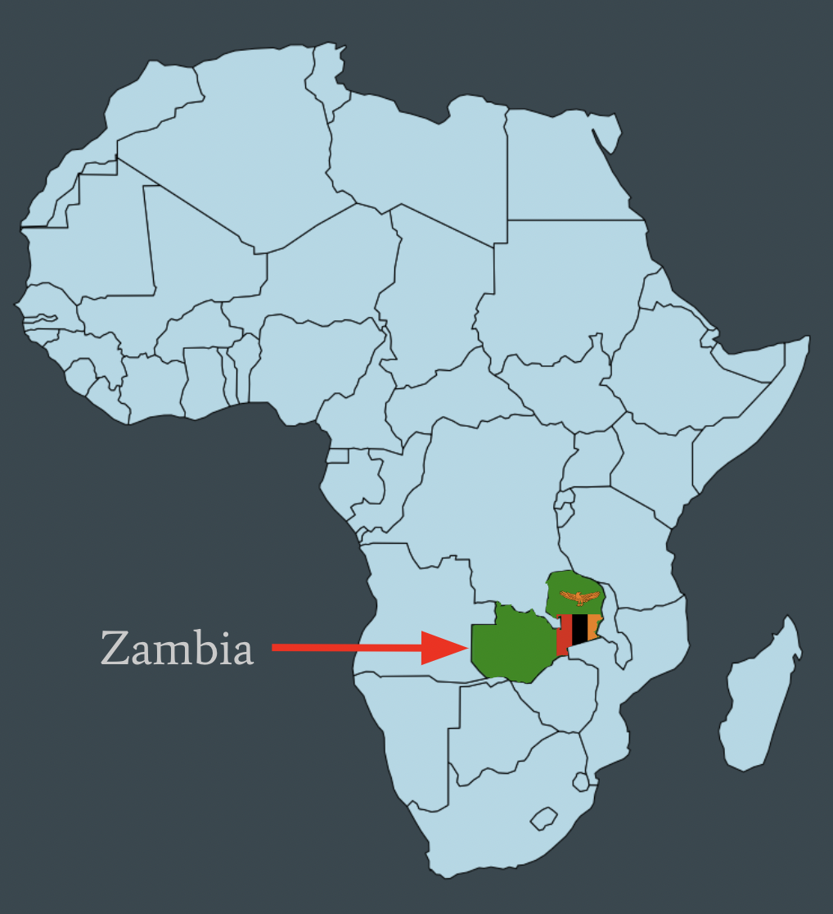

```{r setup, include=FALSE}
knitr::opts_chunk$set(echo = FALSE)
```

#### Diversity, Equity, and Inclusion Considerations in a Zambia Case Study

<center>

{width="40%"}

</center>

My master's capstone project is [**"An open-source pipeline for remote sensing of crop yields under environmental change in sub-Saharan Africa"**](https://github.com/cropmosaiks). The final data products include an open-source programming tool and a database of processed satellite imagery data to be utilized by an audience of researchers, policy-makers, farmers, or anyone else interested in crop yield predictions in Zambia. Because our data products, documentation, and instructions for use are available on the [MOSAIKS API website](https://nadar.gspp.berkeley.edu/home/index/?next=/portal/index/), anyone in the world should be able to access them as long as they have access to a basic computer. The Diversity, Equity, and Inclusion focus of this project is to allow more people to execute spatiotemporal modeling techniques and reproduce our Zambia case study and similar analyses with our processed satellite imagery data. With our preprocessing which reqwuired an exceptional amount of compute power, time, and expertise executed by my team, the following modeling steps for the user do not require powerful compute or a deep understanding of the featurization process. Rather, the following computing steps to run analyses with the images are designed to be able to be executed on a standard laptop.

However, we need to take a step back and ask:

##### "Does everyone in our target audience even have a standard laptop?"

In the context of **diversity, equity, and inclusion**, we recognize that not everyone has the privileges we students have in the United States with access to the computational and financial resources of the University of California educational system.

Furthermore, we should ask:

##### "Does our target audience speak English?" After all, all our documentation is in English.

Recreating our analysis would be impossible to a Zambian farmer who may not speak English.

[Source of Zambia Data](https://datareportal.com/reports/digital-2021-zambia)
