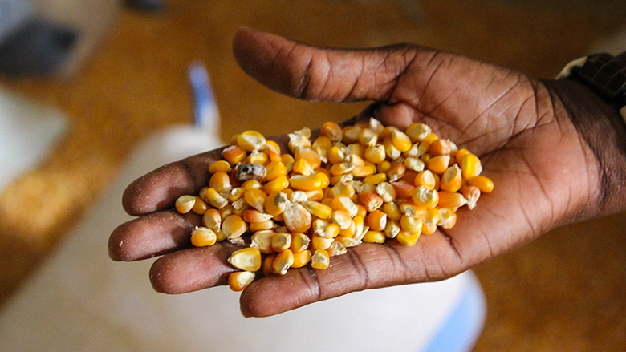

```{r setup, include=FALSE}
knitr::opts_chunk$set(echo = FALSE, eval = FALSE)
```

<center>

{width=30%}{width=59%}

</center>

For my master's capstone project, my team produced [an open-source pipeline](https://github.com/cropmosaiks) for remote sensing of crop yields with a case study focused on the country of Zambia. The final data products included a free programming tool and a database of processed satellite imagery to detect maize yields in sub-Saharan Africa. Our vision was for these products to be utilized by an audience of researchers, policy-makers, farmers, or anyone else interested in crop yield predictions. We published our data products on the [MOSAIKS API website](https://nadar.gspp.berkeley.edu/home/index/?next=/portal/index/) website, which serves as a portal for anyone in the world to access our materials, as long as the user has access to a standard computer. The diversity, equity, and inclusion goal of this project was to allow more people who lack a technical background or computational resources to execute spatiotemporal modeling techniques. My team pre-processed years of satellite imagery to take care of the first steps in the pipeline, with the help of our university-funded compute power and faculty  expertise. As a result, the next steps in the workflow do not require powerful computational resources or a deep understanding of the featurization process on the user's end. Rather, the rest of the analyses was designed to be able to be executed by anyone with a desire to learn.

Expanding spatiotemporal modeling to a wider community is certainly a powerful idea. However,  my capstone team needs to take a step back to consider the **ethics and bias** in our approach by asking the question:

#### "Does everyone in our target audience have access to a computer?"

In the context of **diversity, equity, and inclusion**, we recognize that not everyone has the privileges that we enjoy at the University of California, Santa Barbara. These privileges include access to the computational and financial resources of the university system, support through our graduate program and faculty, and reliable electricity in our homes and work spaces. 

Furthermore, we must ask:

#### "Does our crop model show prediction bias because of bias in the data on which it was trained?" 

To attempt to address these concerns, let's begin by examining the quantity of Zambians who have access to the internet.

### Computer use in Zambia

```{r, include = FALSE}
library(tidyverse)
library(grid)
library(ggimage)
library(jpeg)

# create dataframe manually from the annual data on https://datareportal.com/digital-in-zambia
zambia <- data.frame(
  year = c(2017, 2018, 2019, 2020, 2021, 2022),
  pop_millions = c(16.98, 17.35, 17.87, 18.12, 18.65, 19.19),
  int_users_millions = c(3.57, 5.19, 7.25, 4.43, 5.48, 5.47)
)

# plot pop and internet use with flag as background
plot <- ggplot(data = zambia) +
geom_line(aes(x = year,
              y = pop_millions),
          color = "white",
          size = 2,
          linetype = "dashed") +
  geom_text(aes(2017.5, 6.5, label = "Internet\nUsers", vjust = 1)) +
  theme_light() +
  geom_line(aes(x = year,
                y = int_users_millions),
            color = "white",
            size = 2,
            linetype = "dashed") +
  geom_text(aes(2017.5, 16.5, label = "Total\nPopulation", vjust = 1)) +
  scale_y_continuous(breaks = seq(0, 20, by = 2)) +
  labs(y = "Number of Zambians (millions)",
       x = "Year",
       title = "Population and Computer Users in Zambia, 2017-2022") +
  theme(
    panel.grid.major.x = element_blank(),
    panel.border = element_blank(),
    axis.ticks.x = element_blank(),
    legend.position = "none",
    plot.title = element_text(size = 15, 
                              color = "white",
                              face = "bold",
                              family = "Tahoma"),
    # plot.subtitle = element_text(size = 12,
    #                              color = "white",
    #                              family = "Tahoma"),
    axis.title.x = element_text(size=12, 
                                      color="white", 
                                      face="bold",
                                      angle=0),
    axis.text.x= element_text(family = "Tahoma", 
                                         face="bold", 
                                        color="white",
                                         size=12),
    axis.title.y = element_text(size=12, 
                                      color="white", 
                                      face="bold",
                                      angle=90),
    axis.text = element_text(color = "white")
  )

url = "https://media.istockphoto.com/vectors/zambia-flag-vector-id1091648302?k=20&m=1091648302&s=170667a&w=0&h=TvxkWEggAAB7X3S5iYKUwuViqnsA5zIOLbRwWoEUJqo="
download.file(url, destfile = "flag.jpeg")
img <- readJPEG("flag.jpeg")

ggbackground(plot, url)
```

<center>

{width=78%}

</center>

There appears to be few internet users in Zambia relative to the national population. Other regions of the world have a much higher ratio of internet users to the total population, which represents sub-Saharan Africa as relatively low on the list of global regions with internet users (2). (While these data sources likely have their own bias as well, we will not dive into that in this post.) This data certainly raises a red flag for my teams' data products' accessibility to the people in Zambia, considering that our data products require the user to have internet access. This is a disappointing realization, and hopefully in the future internet use will increase. Until internet use shows more equality across the globe, we understand that our userbase is biased. 

#### A methodological approach to reduce bias

One approach my team and I can adopt in order to reduce bias in the dissemination and userbase of our data products could take the form of ensuring our data product reaches Zambian people and policy-makers across the country that do have access to the internet. Expanding access to electricity and computers may be an unfeasible goal for my team, but we can certainly spread awareness of our tool and communicate it to audiences in Zambia.In turn, these personnel in leadership roles throughout the country can hopefully disseminate this information to people with fewer resources and advocate for their community. This is potentially feasible through the personnel at the Baylis Lab at UC Santa Barbara that provided the data originally. A member of the Baylis Lab is Zambian, and has shown wonderful enthusiasm for connecting my team's data products with policy-makers and leaders in sub-Saharan Africa. Additionally, we can potentially reach Zambians through the [Global Policy Lab](http://www.globalpolicy.science/mosaiks) that hosts our processed satellite imagery within its larger database on the [MOSAIKS API](https://nadar.gspp.berkeley.edu/home/index/?next=/portal/index/) (5). By checking in with the Baylis Lab and the Global Policy Lab on a regular basis and integrating inclusive practices in our future modeling projects, we can methodically reduce bias in our userbase. Outreach, collaboration, and patience can be powerful tools to instigate meaningful change in the scientific community and in governmental policy.  

### Bias in Our Model

Next, let's consider the bias in the "ground-truth" crop data that we used to train our model. My team used a supervised machine learning approach to train a model to predict maize yields based on satellite imagery. My team had access to annual maize yields reported by farmers across the country at district resolution, and we paired this data with satellite images of  farms for several several years. The model "learned" how to identify maize, and therefore can serve as a supplementary tool to quantify maize yields over time, even where and when we lack district-level maize yield data from the farmers themselves.

<center>

{width=70%}

</center>

So how should we go about identifying the bias in our model? One might argue that a model is only as accurate and powerful as the data used to train it, and so we turn to the UC Santa Barbara Baylis Lab's crop data and the metadata. Both the contents of the metadata and what is _not_ present can be useful for identifying potential bias. Firstly, the source and units of the data were not explicitly outlined by the Baylis Lab at the start of this project, and these details are not well-documented by the [Zambia Statistics Agency](https://www.zamstats.gov.zm/agriculture-environment-statistics/) that hosts this data for public use (3). Missing metadata includes the mode of communication through which these surveys were conducted, such as physical meetings with farmers, phone calls, online submissions, or mailed written reports. Differing levels of bias could be associated with each type of communication. For example, if submissions are made online, perhaps this excludes farmers without electricity or access to the internet. If yields are communicated verbally or on paper, farmers might have no way to verify that their reports were entered into the database and processed correctly, and they might not reap the benefits that result of these compiled databases.  

On the other hand, an important detail that was effectively communicated was the resource-intensive nature of these surveys, such as the time it takes to gather the data and personnel required to process it (3). The farmers assess their maize fields each May to report the area planted, expected yields, size of the farm, and total irrigated area. During the harvest season in August, the farmers report the final yields (3). The reports of farm size and irrigated area are rough estimates, and the resource-intensive nature of these surveys means not every farm can be included (3). All these factors imply that perhaps not every farm is surveyed, especially small-scale farms. Furthermore, the fact that farmers might need funding for irrigation from the government or other investors might serve as an incentive to over-report yields to show productivity and potential, or perhaps under-report yields in order to demonstrate a need for more funding.

Lastly, we must consider bias in the satellite data. Considering the resolution of our satellite imagery and its limited ability to penetrate cloud cover during the rainy season, are we consistently documenting every field in Zambia each year? Are the satellites only picking up large farms and systematically missing smaller-acreage farms or those that grow smaller maize because they do not use growth hormones? Assuming perfect accuracy would certainly be bold and irresponsible.

Overall, no data is perfect because no human or satellite can perfectly report agricultural data with consistency. As a result, our model based on two biased data sources is certainly riddled with bias as well. Acknowledging such bias and adjusting our methods in the future is critical to getting closer to the truth, even if we never quite make it there. When scientific modeling is applied to critically important topics such as food security, agricultural funding, and job security in sub-Saharan Africa, it is our responsibility as scientists to ensure we publicize the limitations of our analyses. 

### Conclusion

**The bias that exists in our crop data, satellite data, and the userbase of our data products highlights bias and issues for advancements in farming and data transparency across Zambia and the rest of sub-Saharan Africa.** Farming in this region of the world is partially subsidized through investments from China and other countries, and foreign investments are expected to increase in the future (3). Agricultural investors likely partially base their funding allocation decisions on crop production trends across Zambia and the rest of sub-Saharan Africa. If these investors have more insight into large-scale crop trends than the farmers themselves, or **if these investors receive highly biased data, then my capstone group's diversity, equity, and inclusion goals have not been achieved.** We must not lose sight of error and exclusion in the scientific community regardless of our confidence in technology or our emotional investment in the question we are trying to answer.

**As an aspiring environmental data scientist, it is my duty to consider ethics and bias in my projects and minimize it in the future. My capstone project certainly has not achieved substantive change in the agricultural world, and it likely has not reached anyone in Zambia yet. However, we have educated a niche community of people about the power of remote sensing techniques and laid the foundation for a tool that has potential to inform agricultural policy. Substantive change must begin small before it can gain traction.**

### References & Sources

1. [Datareportal](https://datareportal.com/reports/digital-2021-zambia)

2. [Our World in Data](https://ourworldindata.org/internet)

3. [University of California, Santa Barbara, Department of Geography, Baylis Lab.](https://baylislab.ace.illinois.edu/) Personal communication (April 11, 2022)

4. [Maize photograph](https://www.worldbank.org/en/topic/agriculture/brief/ensure-food-security)

5. [Global Policy Lab](http://www.globalpolicy.science/mosaiks)

6. [MOSAIKS scientific paper](https://www.nature.com/articles/s41467-021-24638-z):\
Rolf, Esther, Jonathan Proctor, Tamma Carleton, Ian Bolliger, Vaishaal Shankar, Miyabi Ishihara, Benjamin Recht, and Solomon Hsiang. “A Generalizable and Accessible Approach to Machine Learning with Global Satellite Imagery.” Nature Communications 12, no. 1 (December 2021): 4392. https://doi.org/10.1038/s41467-021-24638-z.

7. [Zambia Statistics Agency](https://www.zamstats.gov.zm/agriculture-environment-statistics/)


