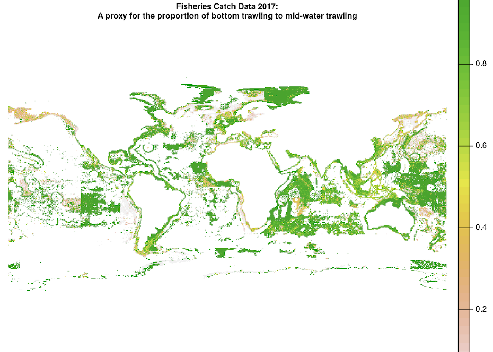
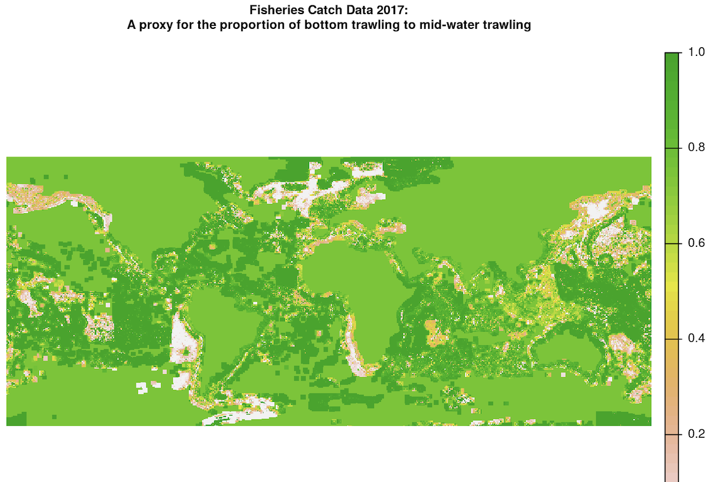
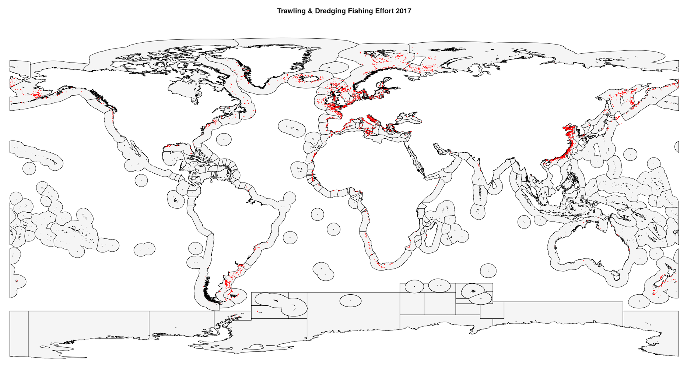

```{r setup, include=FALSE}
knitr::opts_chunk$set(echo = FALSE)
```

# Switching from the `raster` package to `terra` for spatial analysis

Spatial data in `R` has a reputation for being tedious and time consuming. With so many different spatial file types (`.shp`, `.nc`, `.gpkg`, `.geojson`, and `.tif` to name a few) with various resolutions and coordinate reference systems, it can be challenging to produce accurate maps. Many data enthusiasts have historically utilized the `raster` package to wrangle spatial data and produce informative maps. In an effort to stay up to date with the new hip trends in environmental science, the [Ocean Health Index](https://oceanhealthindex.org/) is making the switch from using `raster` to `terra`. The `terra` package is essentially the modern version of `raster`, but with faster processing speeds and more flexible functions. As a data scientist fellow at the Ocean Health Index, I tackled this spatial switch through the lens of Global Fishing Watch data.

Some examples of similar functions between `raster` and `terra` are as follows:

`raster`|`terra`|Use
---|---|---------------
`raster()`|`rast()`|Rasterize a spatial file (such as a `.tif` or a spatial dataframe) into a `rasterLayer` (for the `raster` package) or `spatRaster` (for the `terra` package)
`stack()`|`rast()`|Create raster stack to execute calculations across layers. `terra::rast()` is a more broadly applicable function since it can detect the quantity of `spatRasters` present, then automatically stacks them if there are multiple.
`calc()`|`app()`, `lapp()`, `focal()`, etc.|Execute a function across a raster or raster stack. `terra` has multiple functions with varying degrees of flexibility depending on if the function is applied across layers, and if the same function is applied to each layer.
`resample()`|`resample()`|Convert the origin and/or resolution of a raster to that of another. For example, you might want to add two rasters, but need to convert the first raster from a resolution of 0.5 degrees to 0.01 degrees to match the higher resolution of the second raster.
`extract()`|`extract()`|Pull values from a raster object where they intersect the locations of another spatial object, such as points that fall within polygons. For `raster()`, the spatial objects can be points, lines, and polygons. For `terra`, the second spatial object must be a vector or matrix/dataframe of coordinates. For example, the spatial object from which we are extracting is a geometry columns of polygons, the user cannot input the entire spatial dataframe, but rather needs to vectorize the geometry column of the polygons using `terra::vect()` then input that object into `terra::extract()`. 
`aggregate()`|`aggregate()`|Combine cells of a raster to create a new raster with a lower resolution (larger cells). Aggregation groups rectangular areas to create larger cells. The value for the resulting cells is computed with a user-specified function. Also know as down-sampling.  
`freq()`|`freq()`|Create a frequency table of the values of a raster. 

Let's take a look at how my team and I converted the Ocean Health Index analysis of **marine soft bottom habitat destruction** from `raster` to `terra`.

<br>

### Soft Bottom Habitat Destruction

The way the Ocean Health Index historically calculated soft bottom habitat destruction was by using annual fisheries catch data as a proxy for trawling and dredging activity, because these types of fishing severely disturb benthic habitat. The fisheries catch data is rasterized and overlaid onto polygons of exclusive economic zones for all OHI regions, then spatially standardized by summing each fishing coordinate within the exclusive economic sozne and dividing that sum by the kilometers squared of softbottom habitat. In 2022, OHI switched the data source from fisheries catch to apparent fishing effort for trawling and dredging from [Global Fishing Watch](www.globalfishingwatch.org) using their new [API](https://github.com/GlobalFishingWatch/gfwr). This data comes in units of hours of fishing effort associated with the latitude and longitude of each fishing detection, the geartype used, and a timestamp.

While initially cleaning the Global Fishing Watch data, we separate it into different dataframes for trawling and dredging since we need to process the geartypes differently. In order to convert the fishing effort coordinates into annual `spatRasters`, we use the following approach:

```r
years = as.factor(2012:2020) 

for(i in years){
  # trawling data:
  trawl_annual_raster <- fish_effort_trawl_annual %>%
    dplyr::filter(year == i) %>%
    dplyr::select(-year) %>%
    terra::rast(type = "xyz", crs = "EPSG:4326", digits = 6, extent = NULL)
  
  file <- paste0("fish_effort_trawl_", i, ".tif")
  
  # save annual raster file for trawling:
  terra::writeRaster(
    trawl_annual_raster, 
    filename = here(filepath, file), 
    overwrite = TRUE
  )
}
```

`terra` processes this dataframe into a `spatRaster` object because we simplified it into just 3 columns: x, y, and fishing effort, and with the argument `type = "xyz"` we specified that there's an x value, y value, and other value (z) at that coordinate. Note that the `WGS84` coordinate reference system is specified using the simple `"EPSG:4326"` syntax, rather than the complex `proj4` format that `raster::raster()` prefers: `"+proj=longlat +datum=WGS84 +ellps=WGS84 +towgs84=0,0,0"`. We run the same code for the dredging dataframe. 

Next, we subset the trawling data by filtering for just bottom trawling and exclude mid-water trawling, since bottom trawling is the trawling method that damages the seafloor. In order to do this, we multiply the trawling effort `spatRaster` by another `spatRaster` that represents the proportion of bottom trawling to mid-water trawling at each coordinate, provided by Watson and Tidd (2018). The raw trawling proportion raster has many `NA` values:

<center>
{width=75%}
</center>

We can check the initial resolution, extent, and other characteristics by calling the raster and viewing the output:

```r
class       : SpatRaster 
dimensions  : 360, 720, 1  (nrow, ncol, nlyr)
resolution  : 0.5, 0.5  (x, y)
extent      : -180, 180, -90, 90  (xmin, xmax, ymin, ymax)
coord. ref. : lon/lat WGS 84 (EPSG:4326) 
source      : bottom_trawl_prop_2017.tif 
name        : bottom_trawl_prop_2017 
min value   :                      0 
max value   :                      1 
```

Note that the resolution is 0.5 degrees. We want to up-sample this raster to increase the resolution to that of the fishing raster, which is 0.01 degrees.

In order to multiply these `spatRasters`, we first want to interpolate the bottom trawling proportion raster as accurately as possible. This interpolation takes 2 steps:

**1. Use the local mean of surrounding cells to fill in `NA` values (nearest neighbor) using `terra::focal()`.**

```r
trawl_depth_proportion_interpolated <- terra::focal(
  x = trawl_depth_proportion,
  w = 5, # sets a 5 cell window around NA pixel
  fun = "mean",
  na.policy = "only", # only interpolate NA values
  na.rm = T,
  overwrite = TRUE
)
```

**2. Interpoalte all remaining `NA` values using the `terra::global()` function.**

`global()` can be used similarly to `terra::app()` for simple functions, such as calculating the mean of all non-`NA` values in the entire raster layer:

```r
global_trawl_proportion_avg <- terra::global(
  trawl_depth_proportion_interpolated, 
  fun = "mean",
  na.rm = TRUE
)
  
trawl_depth_proportion_interpolated[is.na(trawl_depth_proportion_interpolated)] <- 
  global_trawl_proportion_avg[1,1]
```

In order to check if any `NA` values remain, we can use other arguments for `terra::global()` that returns the sum of all `NA` values in the `spatRaster`:

```r
terra::global(
  trawl_depth_proportion_interpolated, 
  fun = "isNA"
)
```

Next, we want to resample that `spatRaster` to up-sample the resolution to match that of the other raster, which has a higher resolution of 0.01 degrees:

```r
# resample the interpolated trawling proportion data
# match the resolution of the GFW fishing effort data
trawl_depth_proportion_resampled <- terra::resample(
  x = trawl_depth_proportion_interpolated,
  y = fish_effort_trawl, # use the GFW data as the sample geometry
  method = "near" # nearest neighbor calculation to up-sample
) 
```

The fully interpolated and resampled map for trawling proportion looks like this:

<center>
{width=75%}
</center>

The continents cells are filled in with a value of 1 because they were `NA` before, and we used `terra::global()` to fill in all the remaining `NA` values with 1. While it does not make logical sense to assign land value with a trawling proportion value, this is fine for our case because the only purpose of this raster is to maintain all the trawling fishing effort in the other raster, and subset many of them to a smaller value if the proportion is less than 1. All the land cells that have a value of 1 will be multiplied by NA in the fishing effort raster, so they will not be counted in the final fishing effort scores.

We can check that the resolution was increased to 0.01 degrees by calling the name of the raster again to view the adjusted raster characteristics:

```r
class       : SpatRaster 
dimensions  : 14930, 36001, 1  (nrow, ncol, nlyr)
resolution  : 0.01, 0.01  (x, y)
extent      : -180.005, 180.005, -67.315, 81.985  (xmin, xmax, ymin, ymax)
coord. ref. : lon/lat WGS 84 (EPSG:4326) 
source      : trawl_depth_proportion_resampled_2017.tif 
name        : focal_mean 
min value   :          0 
max value   :          1 
```

Great!

Next, we need to match the `spatRaster` extents, which is the minimum and maximum coordinates in both the x and y directions (xmin, xmax, ymin, ymax). We use `terra::extend()` for this. First extend one `spatRaster` to the extent of the other, and then vice versa to ensure that each of the four dimensions are maximized and consistent with the other `spatRaster`. If we were to use the `raster` package, the equivalent (but slower) function goes by the same name. Both packages also have the function `crop()` that reduces the extent of a larger rater to that of a smaller raster.

```r
trawl_depth_proportion_extended <- terra::extend(
  trawl_depth_proportion_raster,
  fish_effort_raster
)

fish_effort_extended <- terra::extend(
  fish_effort_raster, 
  trawl_depth_proportion_extended
)
```

In order to check if the extents match, we can use `terra::compareGeom()` to return `TRUE` or `FALSE`:

```r
terra::compareGeom(
  fish_effort_extended, 
  trawl_depth_proportion_extended, 
  stopOnError = FALSE # makes the function return FALSE if the extents are different
)

```

There is no direct equivalent `raster` function for `terra::compareGeom()`, and it's quite handy! 

The 2017 map of fishing effort looks like this:

<center>
{width=75%}
</center>

Next, we use `writeRaster()` to re-write the two extended `spatRasters` as `.tif` files to the same directory so we can read them in as `spatRasters` in our next loop. 

The last step before multiplying the `spatRasters` is to stack them. With the `raster` package, we would use `stack()`. With `terra`, we simply read in the `spatRasters` simultaneously from the same directory using the familiar function `rast()` and the result is a `spatRaster` object with two layers that have matching resolutions, origins, and extents!

```r
# define the 2 raster filepaths as an object 
rasters <- here::here('data', 'int', 'fish_effort_annual', 'trawling', i, 'extended') %>% 
  list.files(pattern = ".tif", full = TRUE)

# stack the spatRasters, with each spatRaster representing 1 layer:
trawl_stack <- terra::rast(rasters)
```

Finally, it's time to multiply the `spatRasters`! There are a few options for multiplying, summing, taking the mean of two rasters, or executing custom functions in the `terra` package. For example, you could use `app()`, `lapp()`, `sapp()`, etc. You should choose your calculation function depending on:

1. If you are calculating through layers, across only one layer, if you are using the same calculation on all layers or not (for example, if you have three layers you might execute `x * y * z` or `x * y + z`)

2. If your function is simple (like "sum" or "mean") or a complex custom function that would take much more compute to execute over a large, global `spatRaster`.

Since we are working with only two layers and are executing a basic multiplication, we can use the simplest option: `app()` or have a little more fun with the syntax and use `lapp()` like so:

```r
trawling_corrected <- terra::lapp(
  trawl_stack, 
  fun = function(x,y){return(x*y)}
)
```

If we were working with `rasterLayers` in the `raster` package, we would have used the general function `calc()` for simple calculations.

After cleaning up the dredging `spatRaster`, we want to add the fishing effort associated with each cell to our corrected trawling raster, so we stack them as we did before and execute simple addition across layers:

```r
all_fishing <- terra::app(
  effort_stack, 
  fun = "sum", 
  na.rm = TRUE
)
```

In order to pair the trawling and dredging fishing effort with the 220 OHI regions, we extract the trawling and dredging points from the exclusive economic zone polygons that are associated with each region. In `raster` and `terra`, we would use their respective functions both called `extract()`. `terra::extract()` allows for more flexibility in extracting the proportion of cells that fall within the polygons, if they are on the borders. However, our experience with these functions is that they are very slow to execute.

`exact_extractr::exact_extract()` offers _much_ faster processing speeds, but requires different syntax. This function allows the user different options for the output that range in complexity. For example, one can extract a list of dataframes, each of which contains the cell values and weight (coverage proportion) for one polygon. The user can then use those values and weights as they want. Alternatively, `exact_extractr()` can do a weighted calculation for us, with arguments that specfies a _weighted_ function and the data to use as weights.

```r
years_all <-  as.factor(2012:2020)

for (i in years_all) {
  
  print(paste("Processing ", i, " fishing effort."))
  
  # read in the annual fishing raster for all regions
  # this represents corrected trawling plus dredging data 
  fishing_raster <- terra::rast(paste0(filepath, filename, i, ".tif"))
  
  # extract the fishing effort that falls within the polygons of OHI regions
  extracted <- exactextractr::exact_extract(fishing_raster, ohi_regions_filtered)

  # sum effort by polygon and append polygon dataframes into 1
  all_polygon_effort <- data.frame()

  for (j in seq_along(extracted)) {
    
    df <- extracted[[j]]
    
    weighted_effort_polygon <- df %>%
      # weight the fishing effort within each cell by the porportional coverage of the cell
      mutate(effort = value*coverage_fraction,
             polygon_id = j) %>%
      select(polygon_id, effort) %>%
      group_by(polygon_id) %>%
      summarize(effort_sum = sum(effort, na.rm = TRUE))
    # bind the polygon-specific sum to the master dataframe of polygon sums
    all_polygon_effort <- rbind(all_polygon_effort, weighted_effort_polygon)
    
  }

  # bind regional id's to the polygon id's
  rgn_id <- ohi_regions_filtered$rgn_id
  regional_polygon_effort <- cbind(all_polygon_effort, rgn_id)

  regional_polygon_effort <- regional_polygon_effort %>%
    group_by(rgn_id) %>%
    # combine each land and eez polygon for the same region
    # some of the fishing points landed just on the border of these polygons
    # meaning they are associated with land when they should be in the EEZ
    summarize(effort_sum = sum(effort_sum, na.rm = TRUE)) %>% 
    mutate(year = i)

  # convert this raster info into a csv that represents fishing effort
  # for each OHI region for year i 
  write.csv(regional_polygon_effort, file = paste0(filepath, filename, i, ".csv"),
  row.names = FALSE)
  print(paste0("Saved ", i, " fishing effort csv to ", filepath, filename, i, ".csv"))
}
```

That about covers it for fishing effort rasters. You can find the complete script [here](https://github.com/OHI-Science/ohiprep_v2022/tree/gh-pages/globalprep/hab_prs_hd_subtidal_soft_bottom/v2022) on the OHI github repository for the 2022 assessment. Please feel free to contact the OHI team with any questions or suggestions. For more spatial rangling with `terra`, check out the blog post about our new tidal flats data layer!

#### References

* Daniel Baston (2022). _exactextractr: Fast Extraction from Raster Datasets using Polygons_. R package version 0.8.2, <https://CRAN.R-project.org/package=exactextractr>.

* Global Fishing Watch. [2022]. www.globalfishingwatch.org

* Hijmans R (2022). _terra: Spatial Data Analysis_. R package version 1.6-3, <https://CRAN.R-project.org/package=terra>.

* R Core Team (2022). R: A language and environment for statistical computing. R Foundation for Statistical Computing, Vienna, Austria. URL https://www.R-project.org/.

* Watson, R. A. and Tidd, A. 2018. Mapping nearly a century and a half of global marine fishing: 1869–2015. Marine Policy, 93, pp. 171-177. [(Paper URL)](https://www.sciencedirect.com/science/article/pii/S0308597X18300605?via%3Dihub)

* Wickham H, Averick M, Bryan J, Chang W, McGowan LD, François R, Grolemund G, Hayes A, Henry L, Hester J, Kuhn M, Pedersen TL, Miller E, Bache SM, Müller K, Ooms J, Robinson D, Seidel DP, Spinu V, Takahashi K, Vaughan D, Wilke
  C, Woo K, Yutani H (2019). “Welcome to the tidyverse.” _Journal of Open Source Software_, *4*(43), 1686. doi:10.21105/joss.01686 <https://doi.org/10.21105/joss.01686>.
  


