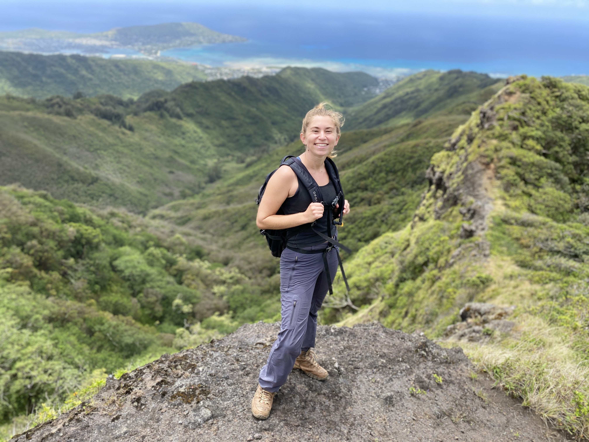

```{r setup, include=FALSE}
knitr::opts_chunk$set(echo = FALSE)
```



My path to become a data scientist did not begin sitting in front of a computer, hacking away in R and Python day in and day out. My journey started as a raccoon trapper, a lizard hunter, an invasive species field technician, and a fisheries technician. I started out collecting data, learned to clean data and enter it into databases, and finally found my passion in gleaning meaningful observations from ecological and environmental data. I grew to love R, Python, and SQL slowly over time. Most importantly, I did not make this journey alone. I found mentors in academic scholars, field crew leaders, and data scientists from conservation organizations that saw my potential and provided the tools to help foster a love for data within me.
