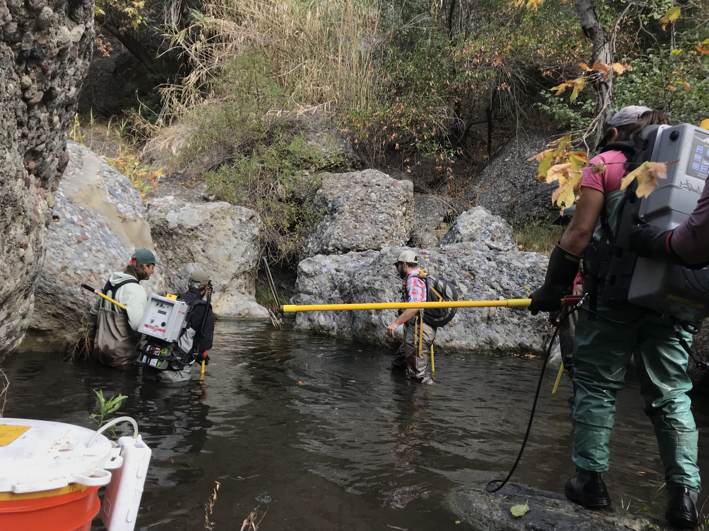

```{r setup, include=FALSE}
knitr::opts_chunk$set(echo = FALSE)
```


My path to become a data scientist did not begin sitting in front of a computer. My journey started as a raccoon trapper, a lizard hunter, an island invasive species technician, and a fisheries technician. I started out collecting data while traversing mountaintops and snorkeling inside aquaculture nets, I learned to clean field data and enter it into databases, and today my passion lies in gleaning meaningful observations from ecological and environmental data. I connected with R, Python, and SQL slowly over time. However, I didn't make this journey alone. I found mentors in academic advisors, field crew leaders, and data scientists that provided the tools to help me grow as a scientist.

### Undergraduate Research at UC Santa Barbara

I earned a B.S. in Ecology and Evolution from UC Santa Barbara, and during this time I served as a research technician in Dr. Doug McCauley's lab in the department of Ecology, Evolution, and Marine Biology. I worked closely with PhD candidate Molly Hardesty-Moore on her research investigating raccoon spatial ecology in urban landscapes. We trapped raccoons around Santa Barbara county and fitted them with radio collars, then tracked them using VHF telemetry techniques for several months for each collar. While the study was primarily interested in luring raccoons into traps overnight, we often caught other small carnivores and saw them peruse the landscape through camera traps throughout Santa Barbara County.


I completed two independent research projects in undergrad: one investigating spatial and temporal niche overlap anomg urban mammals, and one looking at water filtration rates among different bivalve species in Costa Rican Mariculture systems. The latter turned into my first scientific paper, and I had the chance to present my research at a biologicla research symposium in Monteverde, Costa Rica in 2018.


### The Lizard Days

My first job post graduation was a seasonal field technician position surveying for flat tailed-horned lizards in desert habitat just inland of San Diego and El Centro in Southern California. I committed to a three month season working with a small crew composed of three other female field technicians for the Herpetology Department at the San Diego Natural History Museum. I surveyed through the hot, arid desert Monday through Friday, often working 50-hour weeks, and then returned to beautiful Santa Barbara on the weekends to reunite with my friends and pet gecko. These two-day vacations were often filled with indulging in the luxuries of civilization such as washing machines. I would take extensive walks along the bluffs just to admire all the diverse plant communities because they were simply something different than the sea of sparse creosote bushes that surrounded me all week long.


Our team's mission was to systematically survey for flat-tailed horned lizards to determine its range throughout the landscape. This survey was the natural history museum's attempt to prove a that this land is critical habitat for a threatened species and in turn prevent geothermal mining in the region. We did indeed find plenty of lizards, side winder rattlesnakes, nighthawk nests, miscellaneous bones, insects, and kangaroo rat tracks, and badger holes. The sunrises and sunsets in the desert really enhance the beauty and solitude of the desert landscape, and I wouldn't trade those field days for anything. I still think about those flat-tailed horned lizards fairly often and wonder how they're holding up.


### Invasive Species in Hawaii

My second seasonal field job was a field technician and data specialist position at the Oahu Invasive Species Committee. I picked up my life and move to the town of Kaneohe on the island of Oahu and promptly bought a moped and a mosquito net. My work included surveying for incipient invasive species in the lush forests of the Ko'olau mountains on the east side of the island. I quickly fell in love with the extreme ridgelines of the Ko'olau mountains, and I grew tough from the grueling difficulty of the survey field work itself. Despite the difficulty of ascending the elevation while bushwhacking through tangles of invasive specie like strawberry guava and lantana, I loved my time serving the Oahu Invasive Species Committee.


For special operations each month, we also surveyed for plant species in the high elevation forests and in select regions of the other mountain range of the west side; the Waianae mountains.


My coworkers were at the root of my fondness towards my experience working at the Oahu Invasive Species Committee. My field crew taught me about the native flora and fauna on Oahu, the history of the island's people and geology, and how Hawaii's ecology is currently changing. We suffered through endless days bushwhacking and being eaten alive by mosquitos. We bonded by helping untangle each other from invasive plant masses, struggling to get ArcGIS to cooperate after a long day in the rain, and involuntarily screaming in fear when Kahekili and Josh, our helicopter pilots, took dive bombs on aerial surveys just to see how close they could scrape the bird along the top of the invasive albezia trees that cover Manoa Valley. We talked politics and roasted each other on our radios while on surveys, smelled bad all the time, and never missed an opportunity to chase each other around the baseyard with invasive Jackson's chameleons we confiscated from the field. I miss the OISC crew more than any other part of my time in Hawaii.


### Southern California Steelhead Trout

I served as a fisheries technician for the Pacific States Marine Fisheries Commission to survey for the endangered Southern California Steelhead Trout in Santa Barbara, Ventura, and some more southern regions such as Topanga Creek. We conducted surveys for the fish themselves, taking data on their abundance, size, and the environmental conditions of the freshwater streams in which they resided. We also conducted redd surveys, taking data on their nests in shallow freshwater streams, and electric-fished certain streams to get a comprehensive estimate of their population size and PIT tag larger individuals to track their migration upstream during breeding season in December - April, and their return to the Pacific Ocean around April-May.





