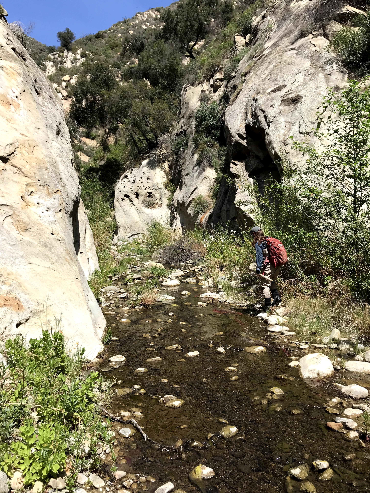
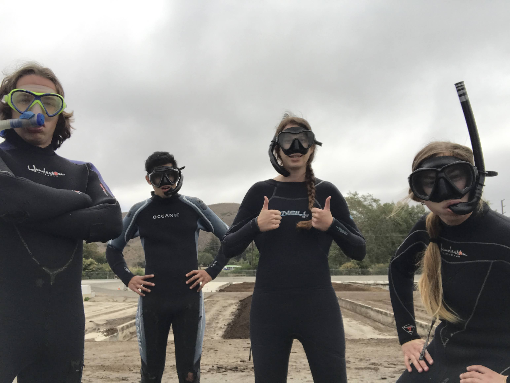

```{r setup, include=FALSE}
knitr::opts_chunk$set(echo = TRUE)
```

<center>

{width="90%"}

</center>

<center>

{width=90%}

</center>

My path to become a data scientist began as a raccoon trapper, a lizard hunter, an island invasive species specialist, and a fisheries technician. I started collecting data while traversing mountaintops and snorkeling inside aquaculture nets, I learned to clean data and enter it into databases in ArcGIS, and today my passion lies in gleaning meaningful observations from ecological and environmental data. I connected with R, Python, SQL, and EML slowly over time. However, I didn't make this journey alone. I found mentors in academic advisers, field crew leaders, and data scientists that provided the tools to help me grow as a data scientist.

{width=90%}

### Undergraduate Research at UC Santa Barbara

I earned a B.S. in Ecology and Evolution from UC Santa Barbara, and during this time I served as a research technician in [Dr. Doug McCauley's lab](https://labs.eemb.ucsb.edu/mccauley/doug/) in the department of [Ecology, Evolution, and Marine Biology](https://www.eemb.ucsb.edu/). I worked closely with PhD candidate [Molly Hardesty-Moore](https://backyardcarnivores.weebly.com/) on her research investigating raccoon spatial ecology in urban landscapes. We trapped raccoons around Santa Barbara county and fitted them with radio collars, then tracked them using VHF telemetry techniques. Molly used this spatial data in conjunction with hair samples from raccoons, foxes, skunks, and opossums to compare behavior and dietary trends in raccoons that live in urban versus rural habitats. While the study was primarily interested in luring raccoons into traps overnight, we often caught other small carnivores and watched them peruse the landscape via camera traps throughout Santa Barbara County.

<center>

{width="50%"}

</center>

I completed two independent research projects in undergrad: one investigating spatial and temporal niche overlap among urban mammals, and one looking at water filtration rates among different bivalve species in Costa Rican mariculture systems. The latter turned into my first scientific paper, and I had the chance to present my research at a biological research symposium in Monteverde, Costa Rica in 2018. (Check out these projects under the **Research** tab.)

<center>

{width=65%}

</center>

{width="70%"}{width=30%}

###### left: Measuring the turbidity of my various species-specific buckets at regular time intervals. I would dive into the mariculture nets each day to collect new bivalve species, run my secchi disk filtration trials with algae and bryozoans in the buckets, then return the bivalves to their natural habitat at the end of the day.

###### Right: One of my bivlavle filtration trials a the off-shore mariculture site. The different species of bilvalves in each filtered the algae and bryozoans at different rates, resulting in different levels of turbidity. 

<center>

{width=50%}

</center>

<center>

{width=50%}

</center>

### The Lizard Days

My first job post graduation was a seasonal field technician position surveying for flat tailed-horned lizards in desert habitat just inland of San Diego and El Centro in Southern California. I committed to a three month season working with a small crew composed of three other female field technicians for the Herpetology Department at the San Diego Natural History Museum. I surveyed through the hot, arid desert Monday through Friday, often working 50-hour weeks, and then returned to beautiful Santa Barbara on the weekends to reunite with my friends and pet gecko. These two-day vacations were often filled with indulging in the luxuries of civilization such as washing machines. I would take extensive walks along the bluffs just to admire all the diverse plant communities because they were simply something different than the sea of sparse creosote bushes that surrounded me all week long.

<center>

{width="60%"}

</center>

<center>

{width=65%}

</center>

Our team's mission was to systematically survey for flat-tailed horned lizards to determine its range throughout the arid desert landscape. This survey was the natural history museum's attempt to prove a that this land is critical habitat for a threatened species and in turn prevent geothermal mining in the region. We did indeed find plenty of spikey lizards, camouflaged side winder rattlesnakes, nighthawk nests, countless skeletons, beetles that play dead, kangaroo rat tracks, and ominous badger holes. The sunrises and sunsets really enhance the beauty and solitude of the desert landscape, and I wouldn't trade those field days driving a truck through the sand for anything. I still think about the flat-tailed horned lizards fairly often. I wonder how they're holding up these days.

<center>

{width="70%"}

</center>

### Invasive Species in Hawaii

My second seasonal field job was a field technician and data specialist position at the [Oahu Invasive Species Committee](https://www.oahuisc.org/). I picked up my life and move to the town of Kaneohe on the island of Oahu and promptly bought a moped and a mosquito net. My work included surveying for incipient invasive plant and insect species in the lush forests of the Ko'olau mountains on the east side of the island of Oahu. I quickly fell in love with the extreme ridgelines of the Ko'olau mountains, and I grew tough from the grueling difficulty of the survey field work. Despite the danger of traversing perilous mountain ranges while bushwhacking through impossible tangles of invasive species like thick strawberry guava tree groves and spikey lantana, I loved my time serving the Oahu Invasive Species Committee.

<center>

{width="75%"}

</center>

For special operations each month, we also surveyed for plant species in the high elevation forests and in select regions of the other mountain range of the west side; the Wai'anae mountains.

<center>

{width="75%"}

</center>

{width="55%"}{width="45%"}

###### Left: An aerial survey for *Miconia calvescens* in the Ko'olau Mountains with my coworker Nick at the Oahu Invasive Species Committee.

###### Right: Ascending a side of a mountian ridge in high-elevation native forest in the Ko'olau Mountains, surveying for native o'hia trees infected with an invasive fungal pathogen called Rapid O'hia Death.

My coworkers were at the root of my fondness towards my experience working at the Oahu Invasive Species Committee. My field crew taught me about the native flora and fauna on Oahu, the history of the island's people and geology, and how Hawaii's ecology is currently changing. We suffered through endless days bushwhacking and being eaten alive by mosquitos. We bonded by helping untangle each other from invasive plant masses, struggling to get ArcGIS to cooperate after a long day in the rain, and involuntarily screaming in fear when Kahekili and Josh, our helicopter pilots, took dive bombs on aerial surveys just to see how close they could scrape along the top of the invasive albezia trees. the field crew talked politics on our radios while on survey, usually smelled moldy, and never missed an opportunity to chase each other around the baseyard with invasive Jackson's chameleons we confiscated from the field. I miss the OISC crew more than any other part of my time in Hawaii.

{width="50%"}{width="50%"}

###### Left: My coworker Ryan and I admiring a waterfall near Waimanalo, Oahu in our Miconia calvescens survey uniforms

###### Right: Our field crew for the day hiking in the lowland Ko'olau forest to reach a remote transect destination area that was filled with mosquitos, mud, and tangled hao plant.

{width="50%"}{width="50%"}

###### Left: My coworkers Phill and Kepano and I discussing the day's survey plan in the middle of native uluhe (the plant species you see here) on a ridge oh the east side of the island

###### Right: Two invasive Jackson's chameleons we found on survey in low-elevation forest. As our job was to remove invasive species to prevent harm to native Hawaiian flora and fauna, we confiscate these individuals from the field because they prey upon native Hawaiian snails.

### Southern California Steelhead Trout

I served as a fisheries technician for the Pacific States Marine Fisheries Commission and the California Department of Fish and Wildlife to survey for the endangered Southern California Steelhead Trout. We conducted surveys for the migratory fish themselves and their resident counterparts, rainbow trout. We collected data on their abundance, size, and the environmental conditions of the freshwater streams in which they resided (temperature, gravel quailty, etc.). We also conducted redd surveys, taking data on trout nests in the gravel bottoms of shallow freshwater streams. We electric-fished certain streams to get a comprehensive estimate of their population size and PIT tag larger individuals to track their migration upstream during breeding season in December - April, and their return to the Pacific Ocean around April-May.

{width="50%"}{width="50%"}

###### Left: A redd survey in Gobernador Creek in Carpinteria, CA.

###### Right: A redd survey in Matilija Creek in Ojai, CA.

<center>

{width="70%"}

{width="50%"}{width="50%"}

###### Left: Measuring a small trout we caught while electric fishing before returning it to the creek.

###### Right: We often found two-striped garter snakes on survey in riparian habiat. This snake species is not aggressive towards predators such as humans, but rather predates on fish (like chub and trout), insects, and other smaller prey.

Lastly, we utilized [DIDSON underwater sonar camera technology](http://www.soundmetrics.com/products/didson-sonars) to film our freshwater streams 24/7 to capture steelhead migrations. We deployed cameras in the Ventura River, Salispuedes Creek, and the Santa Ynez Rvier. These very high-tech cameras utilize sound waves to detect both biotic and abiotic movement in the water, and it was my job to detect trout and other species, such as native chub and invasive catfish, based on their sillouettes in the camera footage.

<center>

{width="65%"}

</center>

<center>

{width="65%"}

</center>

<center>

{width="65%"}

</center>

<center>

{width="65%"}

</center>


