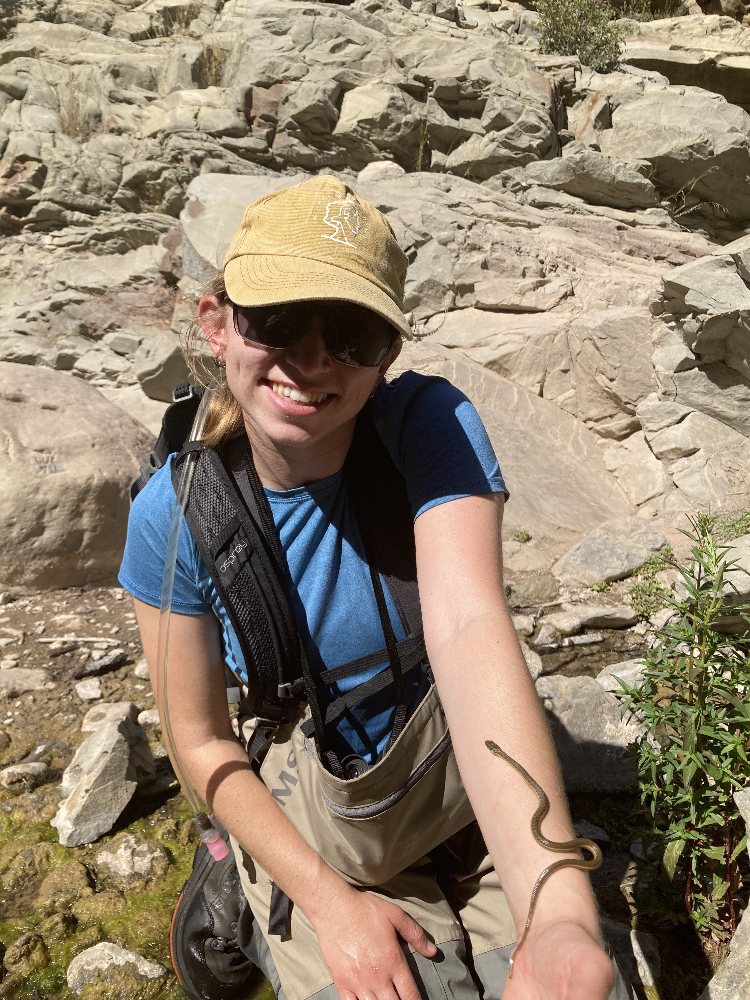

```{r setup, include=FALSE}
knitr::opts_chunk$set(echo = TRUE)
```

<center>

{width="90%"}

</center>

<center>

{width=90%}

</center>

My path to become a data scientist began as a raccoon trapper, a lizard hunter, an island invasive species specialist, and a fisheries technician. I started collecting data while traversing mountaintops and snorkeling inside aquaculture nets, I learned to clean data and enter it into databases in ArcGIS, and today my passion lies in gleaning meaningful observations from ecological and environmental data. I connected with R, Python, and open data science practices slowly over time. However, I didn't make this journey alone; I found mentors in academic advisers, field crew leaders, and data scientists that provided the tools to help me grow.

<center>

{width=70%}

</center>

### Undergraduate Research at UC Santa Barbara

I earned a B.S. in Ecology and Evolution from UC Santa Barbara, and during this time I served as a research technician in [Dr. Doug McCauley's lab](https://labs.eemb.ucsb.edu/mccauley/doug/) in the department of [Ecology, Evolution, and Marine Biology](https://www.eemb.ucsb.edu/). I worked closely with PhD candidate [Molly Hardesty-Moore](https://backyardcarnivores.weebly.com/) on her research investigating raccoon spatial ecology in urban landscapes. We trapped raccoons around Santa Barbara county and fitted them with radio collars, then tracked them using VHF telemetry techniques. Molly used this spatial data in conjunction with hair samples from raccoons, foxes, skunks, and opossums to compare behavior and dietary trends in raccoons that live in urban versus rural habitats. While the study was primarily interested in luring raccoons into traps overnight, we often caught other small carnivores and watched them peruse the landscape via camera traps throughout Santa Barbara County.

Some of my proudest camera trap photos included black bears and bobcats at Sedgwick Reserve:

<center>

{width="45%"}{width=45%}

</center>

<center>

{width=45%}{width=45%}

</center>

I completed two independent research projects in undergrad: one investigating spatial and temporal niche overlap among urban mammals, and one looking at water filtration rates among different bivalve species in Costa Rican mariculture systems. The latter turned into my first scientific paper, and I had the chance to present my research at a biological research symposium in Monteverde, Costa Rica in 2018. (Check out these projects under the **Research** tab.)

<center>

{width=65%}

</center>

{width="60%"}{width=30%}

###### left: Measuring the turbidity of my various species-specific buckets at regular time intervals. I would dive into the mariculture nets each day to collect new bivalve species, run my secchi disk filtration trials with algae and bryozoans in the buckets, then return the bivalves to their marigulture nets.

###### Right: One of my bivalve filtration trials a the off-shore mariculture site. The different species of bilvalves in each filtered the algae and bryozoans at different rates, resulting in different levels of turbidity. 

<center>

{width=40%}

</center>

<center>

{width=40%}

</center>

### The Lizard Days

My first job post graduation was a seasonal field technician position surveying for flat tailed-horned lizards in desert habitat just inland of San Diego and El Centro in Southern California. I worked for the Herpetology Department at the San Diego Natural History Museum. We surveyed through the desert Monday through Friday, often working 50-hour weeks. My weekends were often filled with indulging in the luxuries of civilization such as washing machines and paved roads. I didn't miss the creosote bushes that surrounded me all week long.

<center>

{width="60%"}

</center>

<center>

{width=65%}

</center>

Our team's mission was to survey for flat-tailed horned lizards to determine their range throughout the arid landscape. This survey could prove that this land was critical habitat for a threatened species and prevent mining in the region. We did find plenty of armored lizards, side winders, nighthawk nests, mammal skulls, beetles that play dead, kangaroo rat tracks, and badger tunnels. The sunrises and sunsets emphasized the beauty of the desert landscape; I wouldn't trade those long field days for anything. I still think about the flat-tailed horned lizards fairly often.

<center>

{width="70%"}

</center>

### Invasive Species in Hawaii

My second seasonal field job was a field technician and data specialist position at the [Oahu Invasive Species Committee](https://www.oahuisc.org/). The work included surveying for incipient invasive plant and insect species in the lush forests of the Ko'olau mountains on the east side of the island of Oahu. I quickly fell in love with the extreme ridgelines, despite the discomfort of traversing perilous mountain ranges while bushwhacking through impossible tangles of thick strawberry guava tree groves and thorny lantana.

<center>

{width="75%"}

</center>

We also surveyed for plant species in the high elevation forests and in select regions of the other mountain range of the Wai'anae mountains.

<center>

{width="75%"}

</center>

{width="55%"}{width="45%"}

###### Left: An aerial survey for Miconia calvescens in the Ko'olau Mountains with my coworker Nick at the Oahu Invasive Species Committee.

###### Right: Ascending a side of a mountian ridge in high-elevation native forest in the Ko'olau Mountains, surveying for native o'hia trees infected with an invasive fungal pathogen called Rapid O'hia Death.

My coworkers were at the root of my fondness towards my experience working at the Oahu Invasive Species Committee. My field crew taught me about the native flora and fauna, the history of the island's people and geology, and how Hawaiian ecology is perpetually changing. We endured endless days bushwhacking and being eaten alive by mosquitos. We bonded by helping untangle each other from invasive plant masses, struggling to get ArcGIS and our handheld devices to cooperate in the rain, and screaming in fear when Kahekili and Josh, our helicopter pilots, took dive bombs on aerial surveys just to see how close they could scrape along the top of the albezia trees. The field crew usually smelled sweaty, argued about politics on our radios while on survey, and never missed an opportunity to chase each other around the baseyard with invasive Jackson's chameleons we confiscated from the field. I miss the OISC crew more than any other part of my time in Hawaii.

{width="50%"}{width="50%"}

{width="50%"}{width="50%"}

###### Left: My coworkers Phill and Kepano and I discussing the day's survey plan in the middle of native uluhe on a ridge on the east side of the island.

###### Right: Two invasive Jackson's chameleons we found on survey in low-elevation forest. We confiscated them from the field because they eat the native Hawaiian snails.

### Southern California Steelhead Trout

I served as a fisheries technician for the Pacific States Marine Fisheries Commission and the California Department of Fish and Wildlife to survey for the endangered Southern California steelhead trout and their resident counterparts, the rainbow trout. We collected data on their size, mating behavior, and stream conditions. We conducted redd surveys, taking data on trout nests in the gravel bottoms of shallow streams. We electric-fished certain streams to get a comprehensive estimate of their population size and PIT tag big fish to track their upstream migration during breeding season in December - April, and their return to the Pacific Ocean around April-May. Those trout surveys allowed me to explore the riparian regions of Ojai, Ventura, and Santa Barbara alongside the most devoted and knowledgeable wildlife biologists you'll ever meet. I'm grateful for the memories spotting and measuring fish in crystal pools, getting slightly lost where the streams forked, and identifying frogs, snakes, newts, feathers, and skulls along the way. The steelhead is a special species.

{width="35%"}{width="65%"}

###### Left: A redd survey in Gobernador Creek in Carpinteria, CA.

###### Right: A 20-inch trout spotted on a snorkel survey in Ventura, CA. Movement patterns indicated by a pit tag as well as genetic analysis will reveal if this individual is migratory, as is suggested by its markings and size.

<center>

{width="70%"}

{width="50%"}{width="50%"}

###### Left: Measuring a small trout we caught while electric fishing before returning it to the creek.

###### Right: We often found two-striped garter snakes on survey in riparian habitat. This snake species eats fish like chub and trout, so they hang out in rocky pools.

We used [DIDSON underwater sonar camera technology](http://www.soundmetrics.com/products/didson-sonars) to film our freshwater streams 24/7 to capture possible steelhead migrations. We deployed cameras in the Ventura River, Salispuedes Creek, and the Santa Ynez River. These  high-tech cameras use sound waves to detect both movement in the water, and it was our job to detect trout and other species like turtles and catfish, based on their silhouettes and swimming patterns in the camera footage.

<center>

{width="65%"}

</center>

<center>

{width="65%"}

</center>

<center>

{width="65%"}

</center>

<center>

{width="65%"}

</center>


